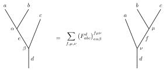
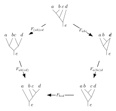

# Fusion Categories

| ID | Assumption | Type | Status |
|----|------------|------|--------|
| A3.1.2.1 | Fusion ring $(R, \{X_i\}_{i\in I}, \mathbf{1})$ with $X_0 = \mathbf{1}$ and $N_{ij}^k \in \mathbb{Z}_{\ge 0}$ (Definition 3.1) | Input | assumed |
| A3.1.2.2 | Associator data $F$ (and, when present, braiding data $R$) satisfy the pentagon/hexagon equations with normalisation recorded in `docs/diagrammatic_calculus.md` | Technical | assumed |

**Definition 3.2** (Fusion category). A **fusion category** over an algebraically closed field $k$ (usually $k = \mathbb{C}$) is a $k$-linear, semisimple, rigid monoidal category
\[
(\mathcal{C}, \otimes, \mathbf{1})
\]
satisfying the following conditions:

1. **Finiteness:** There are finitely many isomorphism classes of simple objects. Every object decomposes as a finite direct sum of simples.

2. **Semisimplicity:** All morphism spaces $\mathrm{Mor}(X,Y)$ are finite-dimensional $k$-vector spaces, and the category is abelian and semisimple.

3. **Rigidity:** Every object $X \in \mathcal{C}$ has a left and right dual $X^*$ with evaluation and coevaluation morphisms satisfying the rigidity axioms.

4. **Simple unit:** The tensor unit $\mathbf{1}$ is simple: $\mathrm{End}(\mathbf{1}) \cong k$.

5. **Finite $k$-linearity:** The monoidal structure is bilinear over $k$, and composition and tensor product of morphisms are $k$-linear.

**Grothendieck ring.** From any fusion category $\mathcal{C}$, we construct its **Grothendieck ring** $K_0(\mathcal{C})$ by
\[
K_0(\mathcal{C}) = \bigoplus_{[X] \in \mathrm{Irr}(\mathcal{C})} \mathbb{Z} [X],
\]
with multiplication
\[
[X] \cdot [Y] = \sum_{Z} N_{XY}^{Z} [Z],
\]
where $N_{XY}^{Z} = \dim_k \mathrm{Mor}(X \otimes Y, Z)$ is the fusion multiplicity. The Grothendieck ring $K_0(\mathcal{C})$ is a fusion ring (Definition 3.1), establishing that **fusion categories categorify fusion rings**.

**Braided fusion categories.** If additionally $\mathcal{C}$ is equipped with a braiding (natural isomorphisms $c_{X,Y}: X \otimes Y \to Y \otimes X$ satisfying hexagon identities), we call $\mathcal{C}$ a **braided fusion category**.

[Etingof–Nikshych–Ostrik, *Ann. Math.* **162** (2005), 581–642, Def. 2.1] `[unverified]`

**Definition 3.3** (F-symbols). The **associator** is a natural isomorphism
\[
\alpha_{a,b,c}: (a \otimes b) \otimes c \xrightarrow{\sim} a \otimes (b \otimes c)
\]
that satisfies the pentagon equation. In a skeletal category (where objects are direct sums of simple objects $X_i$), the associator is determined by its matrix elements, the **F-symbols**.
For simple objects $a,b,c,d$, the isomorphism decomposes into blocks indexed by intermediate fusion channels $e$ (for $(a \otimes b) \to e \to d$) and $f$ (for $(b \otimes c) \to f \to d$).
The change of basis is given by the **F-move**:



Algebraically, the F-symbol $(F_{abc}^d)_{e, \alpha, \beta}^{f, \mu, \nu}$ is the coefficient mapping the basis vector corresponding to the left tree (with intermediate $e$) to the basis vector of the right tree (with intermediate $f$):
\[
\left| (a \otimes b) \otimes c \to d ; e, \alpha, \beta \right\rangle = \sum_{f, \mu, \nu} (F_{abc}^d)_{e, \alpha, \beta}^{f, \mu, \nu} \left| a \otimes (b \otimes c) \to d ; f, \mu, \nu \right\rangle
\]
where $\alpha, \beta, \mu, \nu$ are multiplicity indices (omitted in the diagram if $N_{xy}^z \le 1$).

**Definition 3.4** (Pentagon Equation). The **pentagon equation** ensures that the two paths to re-associate $((a \otimes b) \otimes c) \otimes d$ to $a \otimes (b \otimes (c \otimes d))$ coincide:



In terms of F-symbols (suppressing multiplicity indices for brevity):
\[
\sum_{k} (F_{a,b,c}^k)_e^l (F_{a,k,d}^p)_l^m (F_{b,c,d}^p)_k^n = (F_{a,b,n}^p)_e^m (F_{e,c,d}^m)_l^n
\]
This coherence condition is required for the fusion category to be well-defined.
[Etingof–Nikshych–Ostrik, *Ann. Math.* **162** (2005), §2.1] `[unverified]`

```julia
# file: src/julia/FusionCategories/fusion_category.jl
export FusionCategory, fusion_multiplicity, associator_value, braiding_value,
       is_rigid, grothendieck_ring

"""
    FusionCategory(simples, unit, dual, N; F=..., R=...)

A fusion category as per Etingof–Nikshych–Ostrik (2005), Definition 2.1.

# Fields
- `simples`: Simple object labels (isomorphism classes)
- `unit`: The tensor unit 𝟙 (must be simple: End(𝟙) ≅ ℂ)
- `dual`: Duality map X ↦ X*, implementing rigidity
- `N`: Fusion multiplicities N[(X,Y,Z)] = dim Mor(X ⊗ Y, Z)
- `F`: Associator data (F-symbols), optional
- `R`: Braiding data (R-symbols), optional (for braided fusion categories)

# Axioms (ENO 2005)
1. Finiteness: finitely many simples
2. Semisimplicity: all Mor spaces finite-dimensional
3. Rigidity: every object has dual
4. Simple unit: End(𝟙) ≅ ℂ
5. Finite ℂ-linearity

# Grothendieck Ring
The Grothendieck ring K₀(C) is the fusion ring with basis {[X]} and product
  [X]·[Y] = ∑_Z N_{XY}^Z [Z]
where N_{XY}^Z = dim Mor(X ⊗ Y, Z).

See: docs/fusion_category.md, Definition 3.2
"""
struct FusionCategory
    simples::Vector{Symbol}
    unit::Symbol
    dual::Dict{Symbol,Symbol}
    N::Dict{NTuple{3,Symbol},Int}
    F::Dict{NTuple{6,Symbol},ComplexF64}
    R::Dict{NTuple{3,Symbol},ComplexF64}
    function FusionCategory(simples, unit, dual, N;
                            F=Dict{NTuple{6,Symbol},ComplexF64}(),
                            R=Dict{NTuple{3,Symbol},ComplexF64}())
        @assert unit ∈ simples "Unit must be a simple object"
        @assert all(dual[dual[x]] == x for x in simples) "Dual must be an involution"
        new(simples, unit, dual, N, F, R)
    end
end

"""
    fusion_multiplicity(C::FusionCategory, X, Y, Z) -> Int

Compute N_{XY}^Z = dim Mor(X ⊗ Y, Z), the fusion multiplicity.
"""
fusion_multiplicity(C::FusionCategory, a::Symbol, b::Symbol, c::Symbol) =
    get(C.N, (a, b, c), 0)

"""
    associator_value(C::FusionCategory, ...) -> ComplexF64

Return the F-symbol (associator matrix element) for the given indices.
"""
associator_value(C::FusionCategory, a, b, c, d, e, f) =
    get(C.F, (a, b, c, d, e, f), 0 + 0im)

"""
    braiding_value(C::FusionCategory, X, Y, Z) -> ComplexF64

Return the R-symbol (braiding matrix element) for the given indices.
Only meaningful for braided fusion categories.
"""
braiding_value(C::FusionCategory, a, b, c) =
    get(C.R, (a, b, c), 0 + 0im)

"""
    is_rigid(C::FusionCategory) -> Bool

Check rigidity: dual is an involution and N_{X,X*}^𝟙 = 1 for all simples.
"""
function is_rigid(C::FusionCategory)
    all(C.dual[C.dual[x]] == x for x in C.simples) &&
    all(fusion_multiplicity(C, x, C.dual[x], C.unit) == 1 for x in C.simples)
end

"""
    grothendieck_ring(C::FusionCategory) -> FusionRing

Construct the Grothendieck ring K₀(C) from the fusion category.
This is the decategorification: fusion category → fusion ring.
"""
function grothendieck_ring(C::FusionCategory)
    # Import FusionRing from the fusion_ring module
    # (In practice, this would require proper module structure)
    # Returns a FusionRing with the same N-data
    # FusionRing(C.simples, C.unit, C.dual, C.N)
end
```
