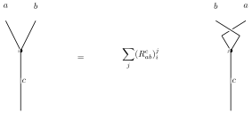
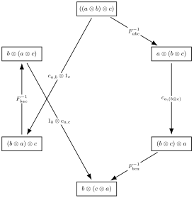

<!-- Note: morphism_spaces.md Definition 3.3 is the canonical definition for morphism spaces.
This document references it to avoid duplication. -->

# Fusion Categories

| ID | Assumption | Type | Status |
|----|------------|------|--------|
| A3.1.2.1 | Fusion ring $(R, \{X_i\}_{i\in I}, \mathbf{1})$ with $X_0 = \mathbf{1}$ and $N_{ij}^k \in \mathbb{Z}_{\ge 0}$ (Definition 3.1.1) | Input | assumed |
| A3.1.2.2 | Associator data $F$ (and, when present, braiding data $R$) satisfy the pentagon/hexagon equations with normalisation recorded in `docs/diagrammatic_calculus.md` | Technical | assumed |

**Definition 3.1.2** (Fusion category). A **fusion category** over an algebraically closed field $k$ (usually $k = \mathbb{C}$) is a $k$-linear, semisimple, rigid monoidal category
\[
(\mathcal{C}, \otimes, \mathbf{1})
\]
satisfying the following conditions:

1. **Finiteness:** There are finitely many isomorphism classes of simple objects. Every object decomposes as a finite direct sum of simples.

2. **Semisimplicity:** All morphism spaces $\mathrm{Mor}(X,Y)$ are finite-dimensional $k$-vector spaces (see Definition 3.1.3 in `docs/morphism_spaces.md`), and the category is abelian and semisimple.

3. **Rigidity:** Every object $X \in \mathcal{C}$ has a left and right dual $X^*$ with evaluation and coevaluation morphisms satisfying the rigidity axioms.

4. **Simple unit:** The tensor unit $\mathbf{1}$ is simple: $\mathrm{End}(\mathbf{1}) \cong k$.

5. **Finite $k$-linearity:** The monoidal structure is bilinear over $k$, and composition and tensor product of morphisms are $k$-linear.

**Grothendieck ring.** From any fusion category $\mathcal{C}$, we construct its **Grothendieck ring** $K_0(\mathcal{C})$ by
\[
K_0(\mathcal{C}) = \bigoplus_{[X] \in \mathrm{Irr}(\mathcal{C})} \mathbb{Z} [X],
\]
with multiplication
\[
[X] \cdot [Y] = \sum_{Z} N_{XY}^{Z} [Z],
\]
where $N_{XY}^{Z} = \dim_k \mathrm{Mor}(X \otimes Y, Z)$ is the fusion multiplicity. The Grothendieck ring $K_0(\mathcal{C})$ is a fusion ring (Definition 3.1.1), establishing that **fusion categories categorify fusion rings**.

**Braided fusion categories.** If additionally $\mathcal{C}$ is equipped with a braiding (natural isomorphisms $c_{X,Y}: X \otimes Y \to Y \otimes X$ satisfying hexagon identities), we call $\mathcal{C}$ a **braided fusion category**.

[Etingof–Nikshych–Ostrik, *Ann. Math.* **162** (2005), 581–642, Def. 2.1] `[unverified]`

**Definition 3.1.4** (F-symbols). The **associator** is a natural isomorphism
\[
\alpha_{a,b,c}: (a \otimes b) \otimes c \xrightarrow{\sim} a \otimes (b \otimes c)
\]
that satisfies the pentagon equation. In a skeletal category (where objects are direct sums of simple objects $X_i$), the associator is determined by its matrix elements, the **F-symbols**.
For simple objects $a,b,c,d$, the isomorphism decomposes into blocks indexed by intermediate fusion channels $e$ (for $(a \otimes b) \to e \to d$) and $f$ (for $(b \otimes c) \to f \to d$).
The change of basis is given by the **F-move**:

Algebraically, the F-symbol $(F_{abc}^d)_{(e,\alpha,\beta)}^{(f,\mu,\nu)}$ is the coefficient mapping the basis vector corresponding to the left tree (with intermediate $e$) to the basis vector of the right tree (with intermediate $f$):
\[
\left| (a \otimes b) \otimes c \to d ; e, \alpha, \beta \right\rangle = \sum_{f, \mu, \nu} (F_{abc}^d)_{(e,\alpha,\beta)}^{(f,\mu,\nu)} \left| a \otimes (b \otimes c) \to d ; f, \mu, \nu \right\rangle
\]

**Index structure** (see Definition 3.5.4a in `diagrammatic_calculus.md` for full details):
- $a, b, c, d \in \mathrm{Irr}(\mathcal{C})$: simple objects (external labels)
- $e, f \in \mathrm{Irr}(\mathcal{C})$: intermediate fusion channels (also simple objects)
- $\alpha \in \{1, \ldots, N_{ab}^e\}$: multiplicity index for $a \otimes b \to e$
- $\beta \in \{1, \ldots, N_{ec}^d\}$: multiplicity index for $e \otimes c \to d$
- $\mu \in \{1, \ldots, N_{bc}^f\}$: multiplicity index for $b \otimes c \to f$
- $\nu \in \{1, \ldots, N_{af}^d\}$: multiplicity index for $a \otimes f \to d$

**Compact notation.** In the multiplicity-free case ($N_{xy}^z \in \{0,1\}$), we write $(F_{abc}^d)_e^f$.

**Definition 3.1.5** (Pentagon Equation). The **pentagon equation** ensures that the two paths to re-associate $((a \otimes b) \otimes c) \otimes d$ to $a \otimes (b \otimes (c \otimes d))$ coincide:

In terms of F-symbols (multiplicity-free case, where all indices are intermediate fusion channels):
\[
\sum_{g} (F_{abc}^g)_e^f \, (F_{afd}^p)_g^h \, (F_{bcd}^h)_f^k = (F_{ecd}^p)_g^k \, (F_{abk}^p)_e^h
\]
where:
- $a, b, c, d$: the four simple objects being re-associated
- $p$: the total fusion outcome (simple object)
- $e, f, g, h, k$: intermediate fusion channels (all simple objects)

For the full equation with multiplicity indices, see Definition 3.5.4c in `diagrammatic_calculus.md`.

This coherence condition is required for the fusion category to be well-defined.
[Etingof–Nikshych–Ostrik, *Ann. Math.* **162** (2005), §2.1] `[unverified]`

**Definition 3.1.6** (R-symbols). For a braided fusion category, the **braiding isomorphism** $c_{a,b}: a \otimes b \to b \otimes a$ provides a natural way to permute tensor factors. These isomorphisms satisfy the hexagon equations.
For simple objects $a,b,c$, the braiding isomorphism is represented by its matrix elements, the **R-symbols**.
The change of basis due to braiding is given by the **R-move**:

Algebraically, the R-symbol $(R_{ab}^c)_{\alpha}^{\beta}$ relates the fusion bases before and after braiding:
\[
c_{a,b} \left| a \otimes b \to c; \alpha \right\rangle = \sum_{\beta} (R_{ab}^c)_{\alpha}^{\beta} \left| b \otimes a \to c; \beta \right\rangle
\]

**Index structure** (see Definition 3.5.4b in `diagrammatic_calculus.md` for full details):
- $a, b \in \mathrm{Irr}(\mathcal{C})$: simple objects being braided
- $c \in \mathrm{Irr}(\mathcal{C})$: total fusion outcome (with $N_{ab}^c \geq 1$)
- $\alpha \in \{1, \ldots, N_{ab}^c\}$: multiplicity index for $a \otimes b \to c$
- $\beta \in \{1, \ldots, N_{ba}^c\}$: multiplicity index for $b \otimes a \to c$

**Compact notation.** In the multiplicity-free case, we write $R_{ab}^c$ (a scalar for each $a, b, c$).

**Definition 3.1.7** (Hexagon Equations). The **hexagon equations** are coherence conditions that relate the associator (F-symbols) and the braiding (R-symbols), ensuring consistency between re-associating and braiding operations. There are two hexagon equations.

Diagrammatically:

In terms of F-symbols and R-symbols (multiplicity-free case):

**First hexagon:**
\[
R_{ac}^e \, (F_{acb}^d)_e^f \, R_{bc}^f = \sum_g (F_{cab}^d)_e^g \, R_{ab}^g \, (F_{abc}^d)_g^f
\]

**Second hexagon:**
\[
(R_{ca}^e)^{-1} \, (F_{acb}^d)_e^f \, (R_{cb}^f)^{-1} = \sum_g (F_{cab}^d)_e^g \, (R_{ba}^g)^{-1} \, (F_{abc}^d)_g^f
\]

where $a, b, c, d$ are simple objects and $e, f, g$ are intermediate fusion channels.

For the full equations with multiplicity indices, see Definition 3.5.4d in `diagrammatic_calculus.md`.

These equations ensure that braiding past a composite object can be decomposed consistently.
[Etingof–Nikshych–Ostrik, *Ann. Math.* **162** (2005), §2.1] `[unverified]`

