# **One-dimensional itinerant interacting non-Abelian anyons**

Didier Poilblanc,1[,\\*](#page-15-0) Adrian Feiguin,2 Matthias Troyer,3 Eddy Ardonne,4,5 and Parsa Bonderson6 *Laboratoire de Physique Theorique UMR-5152, CNRS and Universit ´ e de Toulouse, F-31062 Toulouse, France ´ Department of Physics, Northeastern University, Boston, Massachusetts 02115, USA Theoretische Physik, ETH Zurich, 8093 Zurich, Switzerland Nordita, Royal Institute of Technology and Stockholm University, Roslagstullsbacken 23, SE-106 91 Stockholm, Sweden Department of Physics, Stockholm University, AlbaNova University Center, SE-106 91 Stockholm, Sweden Station Q, Microsoft Research, Santa Barbara, California 93106-6105, USA* (Received 5 November 2012; revised manuscript received 18 January 2013; published 6 February 2013)

We construct models of interacting itinerant non-Abelian anyons moving along one-dimensional chains. We focus on itinerant Ising (Majorana) and Fibonacci anyons, which are, respectively, related to SU(2)2 and SU(2)3 anyons and also, respectively, describe quasiparticles of the Moore-Read and Z3-Read-Rezayi fractional quantum Hall states. Following the derivation of the electronic large-*U* effective Hubbard model, we derive effective anyonic *t*-*J* models for the low-energy sectors. Solving these models by exact diagonalization, we find a fractionalization of the anyons into charge and (neutral) anyonic degrees of freedom—a generalization of spin-charge separation of electrons which occurs in Luttinger liquids. A detailed description of the excitation spectrum can be performed by combining spectra for charge and anyonic sectors. The anyonic sector is that of a *squeezed* chain of localized interacting anyons and, hence, is described by the same conformal field theory (CFT), with central charge *c* = 1*/*2 for Ising anyons and *c* = 7*/*10 or *c* = 4*/*5 for Fibonacci anyons with antiferromagnetic or ferromagnetic coupling, respectively. The charge sector is the spectrum of a chain of hard-core bosons subject to phase shifts which coincide with the momenta of the combined anyonic eigenstates, revealing a subtle coupling between charge and anyonic excitations at the microscopic level (which we also find to be present in Luttinger liquids), despite the macroscopic fractionalization. The combined central charge extracted from the entanglement entropy between segments of the chain is shown to be 1 + *c*, where *c* is the central charge of the underlying CFT of the localized anyon (squeezed) chain.

### DOI: [10.1103/PhysRevB.87.085106](http://dx.doi.org/10.1103/PhysRevB.87.085106) PACS number(s): 75*.*10*.*Kt, 75*.*10*.*Jm, 75*.*40*.*Mg

# **I. INTRODUCTION**

One of the most significant pursuits in condensed matter physics is the search for quasiparticles or excitations that obey non-Abelian exchange statistics[.1–4](#page-15-0) The most prominent candidates (at present) are excitations of non-Abelian quantum Hall states.[5–9](#page-15-0) In particular, there is evidence from tunneling[10](#page-15-0) and interferometr[y11,12](#page-15-0) experiments supporting the existence of non-Abelian quasiparticle excitations for the *ν* = 5*/*2 quantum Hall state.[13](#page-15-0)[–15](#page-16-0)

The leading candidate quantum Hall states to describe the electronic ground state of the quantum Hall plateau at filling fraction *ν* = 5*/*2 are the Moore-Read (MR) Pfaffian state[5](#page-15-0) and its particle-hole conjugate, the "anti-Pfaffian" (aPf) state.[7,8](#page-15-0) Despite the differences between the MR and the aPf states (which manifest in the detailed structure of the edge states), the non-Abelian anyonic structures of their bulk quasiparticles are simply the complex conjugates of each other. Both can be described in terms of an Ising-type anyon model.

One of the leading candidates to describe the experimentally observed *ν* = 12*/*5 quantum Hall platea[u16,17](#page-16-0) is the *k* = 3 Read-Rezayi (RR) stat[e6](#page-15-0) (a generalization of the MR state), or, more precisely, its particle-hole conjugate (RR). Non-Abelian quasiparticles of the RR and RR states are of the Fibonacci type, and the *ν* = 12*/*5 quantum Hall state is the leading candidate system hosting such non-Abelian anyons. The other leading candidate for describing the *ν* = 12*/*5 quantum Hall effect is provided by Bonderson-Slingerland (BS) states[9](#page-15-0) obtained hierarchically from the MR and aPf *ν* = 5*/*2 states (by condensing Laughlin-type quasiholes). The quasiparticles of these BS states have an Ising-type non-Abelian structure similar to that of their MR and aPf parent states. Numerical studies of the *ν* = 12*/*5 quantum Hall state found the RR and BS candidates to be in close competition.[18](#page-16-0)

Interestingly, a different hierarchical construction over the MR state (condensing fundamental non-Abelian quasielectrons) produces a candidate state for filling *ν* = 18*/*7 that possesses non-Abelian quasiparticles of the Fibonacci type,[19](#page-16-0) similar to the ones appearing in the non-Abelian spin-singlet (NASS) state.[20](#page-16-0) However, a quantum Hall state at *ν* = 18*/*7 has, so far, not been experimentally observed.

Another promising class of candidates for realizing non-Abelian quasiparticles is provided by systems with the socalled emergent Majorana zero modes, which behave like Ising-type anyons under exchange. Majorana zero modes were originally predicted to exist in vortex cores of chiral *p*-wave superconductors[21,22](#page-16-0) or at the ends of one-dimensional (1D) polarized superconductors[.23](#page-16-0) More recently, it was shown that Majorana fermions can form at the interface of a strong topological insulator and an *s*-wave superconductor [.24](#page-16-0) This idea for realizing Majorana fermion zero modes was further developed by several groups[,25–28](#page-16-0) who proposed similar superconducting heterostructures based on semiconductors exhibiting strong spin-orbit coupling, rather than topological insulators. For a review, see Ref. [29.](#page-16-0) Efforts to physically implement these latest proposals have been made in recent experiments[,30–33](#page-16-0) consisting of electrons tunneling into a nanowire (set up to be in a topological phase supporting edge Majorana modes). However, neither the exponential localization to the edges of the observed zero modes nor the non-Abelian exchange statistics has been probed yet.

Inspired by these recent developments and possible realizations of quasiparticles with non-Abelian statistics, we consider the question of what happens if one confines mobile non-Abelian quasiparticles to 1D systems. The concept of itinerancy of interacting non-Abelian quasiparticles is of direct physical significance, and the microscopic models we study can be viewed, for example, as (crude) effective models relevant to edge modes of quantum Hall and Majorana fermion systems. It was established long ago, starting with the work of Anderson,34 that electrons confined to one dimension undergo "spin-charge separation," namely, the electron falls apart into two pieces—one spinless, carrying the charge, and the other a spinon without charge, carrying the spin. These ideas were further developed by several people, Tomonaga, 35, Luttinger, 36 and Haldane,37 who introduced the concept of the 1D *Luttinger* liquid.

In our recent Letter,38 we started to investigate the subject of itinerant non-Abelian anyons in a 1D system. We established that non-Abelian anyons (of which the quasiparticles of the quantum Hall states and the Majorana zero modes discussed above are prime examples) also undergo a process which resembles spin-charge separation. Namely, the non-Abelian anyons fractionalize into charge (or density) and anyonic degrees of freedom. The model introduced in Ref. 38 was inspired by the electronic *t-J* model,39 which can be viewed as a limiting case of the Hubbard model40–42—namely in the limit of large on-site repulsion—and for which spin-charge separation was established analytically at a supersymmetric point43–45 and numerically.46 In this paper, we continue our study of itinerant non-Abelian anyons and provide greater detail.

The outline of the paper is as follows: In Sec. II we review briefly general properties of non-Abelian anyons in  $SU(2)_k$ Chern-Simons theories and, more specifically, in non-Abelian quantum Hall states. In Sec. III, we show that, in close analogy to the electronic case, it is possible (i) to truncate the Hilbert space of quasiparticles of non-Abelian quantum Hall states confined to a 1D geometry (in the case of a strong charging energy) and (ii) to derive low-energy effective anyonic t-Jmodels. The charge sectors of the anyonic t-J models are derived in Sec. IV. In Sec. V, we present a short review of the properties of dense (localized) non-Abelian anyon chains. In Sec. VI, we demonstrate that the excitation spectrum of anyonic t-J models can be accurately described by combining spectra for charge and anyonic sectors (in a subtle manner) and provide clear evidence of the fractionalization of anyons into charge and anyonic degrees of freedom. In Sec. VII, we use density matrix renormalization-group (DMRG) calculations to extract the central charge of the Fibonacci t-J chain from the entanglement entropy between segments of open chains, providing further evidence of fractionalization. In Appendix A, we provide detailed descriptions of the related anyon models of the MR and RR states. In Appendix A, we describe the details of the quasiparticle spectrum truncation for MR and RR anyons used in this paper.

## II. NONABELIAN ANYONS

## A. General considerations and fusion algebra

The non-Abelian anyons we are concerned with in this paper can formally be described by  $SU(2)_k$  Chern-Simons

theories or via a certain quantum deformation of SU(2). In either case, the non-Abelian degrees of freedoms are captured by the "topological charges" j, which can be thought of as "generalized angular momenta." For a given SU(2)k theory, these are constrained to take the values  $j = 0, \frac{1}{2}, \dots, \frac{k}{2}$ , loosely corresponding to the first k + 1 representations of SU(2).

In the same way that the tensor product of SU(2) spins can be decomposed into the direct sum of multiplets of definite values of  $J^2$ , one can decompose the product, or "fusion," of anyons. This fusion algebra or the "fusion rules" of a general anyon model take the form

$$a \times b = \sum_{c \in \mathcal{C}} N_{ab}^c c,\tag{1}$$

where a, b, and c are topological charge values in the set of allowed topological charges C, and the fusion coefficients  $N^c_{ab}$  are non-negative integers indicating the number of ways a and b can fuse to produce c. The  $N^c_{ab}$  must be such that the algebra is commutative and associative. There must also be a unique "vacuum" or "trivial" charge, which we denote I or 0, for which  $N^c_{a0} = \delta_{ac}$ .

The fusion rules of  $SU(2)_k$  anyons resemble their SU(2) counterparts (but with a finite set of allowed values for j and a corresponding truncation of the algebra). In particular,

$$j_1 \times j_2 = \sum_{j_3 = |j_1 - j_2|}^{\min\{j_1 + j_2, k - j_1 - j_2\}} j_3, \tag{2}$$

where the upper limit is such that the fusion rules are associative and obey the constraint that  $j_i \leqslant \frac{k}{2}$ .

We are particularly interested in the cases k=2 and 3, because they are the experimentally most relevant non-Abelian anyon models. (The case k=1 corresponds to Abelian anyon models, in which case the Hilbert spaces we construct below are one-dimensional, so one cannot construct nontrivial models.) These cases are related to the Ising and Fibonacci anyons models, respectively, which we now consider in more detail.

The anyon model with k=2 has three anyon types, which we label using the Ising TQFT topological charges I,  $\sigma$ , and  $\psi$  as follows: The vacuum or trivial anyon I corresponds to j=0. The anyon of type  $\sigma$  corresponds to  $j=\frac{1}{2}$ . Finally, the (fermionic) anyon type  $\psi$  corresponds to j=1. In particular, the fusion rules read47

$$\sigma \times \sigma = I + \psi, \quad \sigma \times \psi = \sigma, \quad \psi \times \psi = I,$$
 (3)

in addition to the general relations  $\alpha \times \beta = \beta \times \alpha$  and  $I \times \alpha = \alpha$ , which hold in all anyon models, for arbitrary  $\alpha$  and  $\beta$ .

The Fibonacci anyon model corresponds to the case k=3, where we restrict ourselves to the integer-valued j=0 and 1, which we label vacuum I and Fibonacci anyon  $\tau$ , respectively.48 The Fibonacci fusion rule reads

$$\tau \times \tau = I + \tau. \tag{4}$$

In the following we consider itinerant anyons moving on 1D chains. Pictorial representations of such anyonic chains are shown in Figs. 1(b) and 1(c), together with the more familiar case of strongly correlated electrons shown in Fig. 1(a).

For the case of strongly correlated electrons, each electron carries a unit charge and spin  $\frac{1}{2}$ . The spin- $\frac{1}{2}$  degrees of freedom

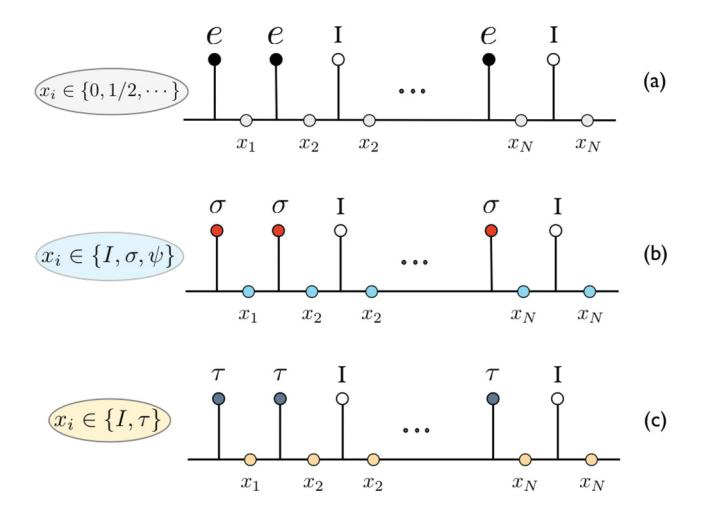

FIG. 1. (Color online) Anyonic fusion trees for (a) electrons, (b) Ising  $\sigma$  anyons, and (c) Fibonacci anyons. Sites are denoted by the (filled or open) circles at the top of the diagrams. Open circles denote vacant sites, which carry the vacuum or trivial topological charge 0 or I. The bond labels  $\{x_i\}$  encode nonlocal information about the state and their possible values are specified for each model. We note that, for Ising anyons, our model excludes  $\psi$  anyons on the sites but not on the links (see the text).

are taken into account in Fig. 1(a) in a slightly unconventional way, utilizing a "fusion tree" notation, rather than the usual tensor product of N two-dimensional local Hilbert spaces (where N is the number of electrons). In this notation, the labels  $x_i$  for the links of the fusion tree correspond to the total spin obtained by combining the spin  $x_{i-1}$  with that of the ith electron. For an open chain, this simply means that  $x_i$  is the total spin of all the electrons to the left of the label. For a periodic chain (in a system on a torus), the label has a slightly more abstract interpretation, since the notion of all particles to the left or right is not well defined. We use this formulation because it easily generalizes to the case of non-Ablian anyons, where there are no local degrees of freedom (i.e., they lack local Hilbert spaces and internal quantum numbers, similar to  $s_i$  in the case of spins).

The non-Abelian anyons in Figs. 1(b) and 1(c) may also carry an electric charge (albeit this typically is a fraction of the charge of the electron), as well as anyonic degrees of freedom. The charge degrees of freedom live on the sites, while the bond variables  $x_i$  encode the anyonic degrees of freedom along the fusion tree, in the same way as the labels  $x_i$  encoded the spin of the electrons in Fig. 1(a). Abelian anyonic degrees of freedom may be treated in the same way as electric charge, i.e., locally assigned to the sites, since their resulting fusion tree is uniquely determined by the local degrees of freedom. The labels  $x_i$  are not arbitrary but satisfy the constraint that each trivalent vertex in this fusion tree is permitted by the fusion rules. This implies that the size of the *internal* Hilbert space (for a given configuration of particle/anyon positions) grows as  $2^N$  in the case of electrons,  $(\sqrt{2})^N$  in the case of Ising anyons, and  $\phi^N$  in the case of Fibonacci anyons, where  $\phi = \frac{1+\sqrt{5}}{2}$  is the golden ratio. Here, N corresponds to the number of electrons, Ising  $\sigma$  anyons, or Fibonacci anyons. The actual dimension for any finite N is, of course, an integer, so these are only

the leading order scaling (as  $N \to \infty$ ) for the non-Abelian anyons. The sites labeled *I* correspond to vacancies and carry no electric charge, spin, or anyonic degrees of freedom.

Before we continue, in Sec. IIB, with a description of the quantum Hall states in which these types of anyons are realized, we want to make one remark, which is essential in the subsequent description of the behavior of itinerant anyons. Despite the fact that we are describing mobile, but identical, anyons, there will be a notion of "distinguishability" of the anyons. In particular, the various states in the Hilbert space are characterized not only by the location of the occupied sites, but also by the labels  $x_i$ , which distinguish the various states, given the location of all the anyons. In some sense, specifying the precise internal state, corresponding to all the anyons as a whole, renders the individual anyons in a particular state distinguishable. We see later that this seemingly simple observation plays an essential role in the effective description of the collective behavior of itinerant anyons.

### B. Non-Abelian quantum Hall states

We now concentrate on describing the anyonic structure of the MR and k = 3 RR states in their fermionic incarnations, which are relevant in the electronic quantum Hall setting. Because of the fermionic nature of the states, the anyonic structure is slightly more complicated than the  $SU(2)_k$  anyons described above. To describe this structure, it is best to consider the non-Abelian part separately, which is described in terms of Ising anyons for the MR state and  $\mathbb{Z}_3$  parafermions for the k = 3 RR state.

In the case of the MR state, the non-Abelian sector is the Ising theory, whose fields are  $I, \sigma, \psi$ , with the Ising fusion rules given above. The quasiparticle types can now be specified by the Ising label, together with the electric charge. The vacuum is (I,0), while  $(\sigma,e/4)$  is the "fundamental quasiparticle," which, in some sense, carries the "smallest" quantum numbers allowed in the MR state; i.e., it has the smallest (nonzero) electric charge and repeated fusion generates the entire spectrum of topological charges. All other quasiparticles are thus obtained by repeated fusion of this fundamental quasiparticle, using the fusion rules above and the additivity of the charge. In addition, one needs the rule that quasiparticles which differ by fusion of an electron, given by  $(\psi,e)$ , are to be identified. The fact that we identify quasiparticles which "differ by a fermion" (or identify the electron with the vacuum) leads to some complications, which are not present for the bosonic versions of these quantum Hall states, 49 but these complications do not concern us here. The resulting quasiparticle spectrum is given in Fig. 2(b), where we have six quasiparticle types [shown as filled (green) circles], because (I,e) and  $(\psi,0)$  are identified, and so on.

In the case of the RR state with k=3, the non-Abelian structure corresponds to  $\mathbb{Z}_3$  parafermions, which conventionally are labeled  $I, \psi_1, \ \psi_2, \ \sigma_1, \ \sigma_2, \ \varepsilon$ . We, however, use the notation  $\psi_0 = I$ ,  $\tau_0 = \varepsilon$ ,  $\tau_2 = \sigma_1$ , and  $\tau_1 = \sigma_2$ . In this way, the fusion rules take the simple form

$$\psi_i \times \psi_j = \psi_{i+j}, \quad \psi_i \times \tau_j = \tau_{i+j}, \quad \tau_i \times \tau_j = \psi_{i+j} + \tau_{i+j},$$
(5)

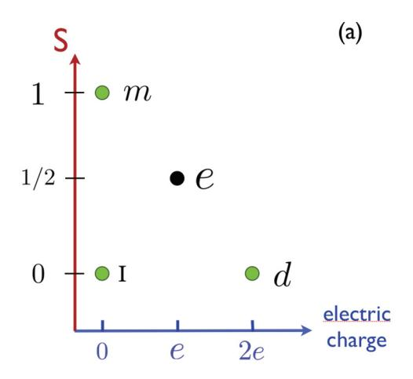

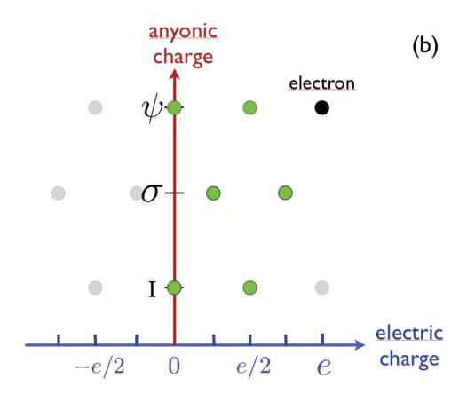

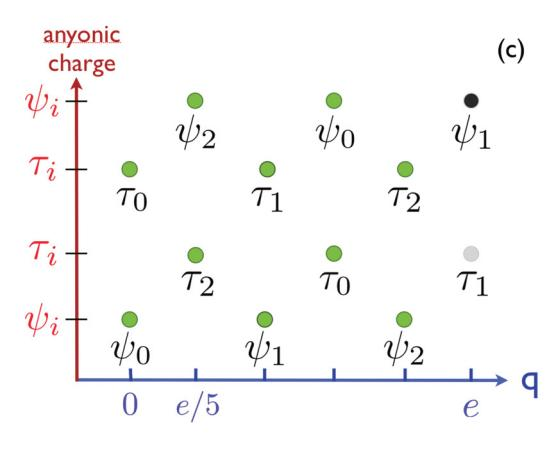

FIG. 2. (Color online) Charts of the quasiparticle contents of (a) the electronic Hubbard model, (b) the MR state, and (c) the *k* = 3 RR state. The elementary electric charges of the MR quasiparticles are multiples of *e/*4, while those of the RR quasiparticles are multiples of *e/*5. Dark (green) circles correspond to the different particle types. Filled black circles represent electrons/holes, which are identified with the vacuum (*I,*0) in (b) and the vacuum (*ψ*0*,*0) in (c). Gray circles correspond to particles which are identified with one of the particles corresponding to a green symbol, as explained in the text.

where the indices are taken modulo 3. This is the direct product of the Fibonacci fusion algebra with a Z3 fusion algebra. The quasiparticle types can now be specified by the Z3-parafermion label, together with the electric charge. The vacuum is (*ψ*0*,*0), while the fundamental quasiparticle's quantum numbers are (*τ*2*,e/*5). As in the MR state, the other quasiparticles are obtained by repeated fusion of the fundamental quasiparticle, using the fusion rules above. Quasiparticles which differ by fusion of an electron, given by (*ψ*1*,e*), are to be identified. This gives rise to 10 quasiparticle types, displayed as filled (green) circles in Fig. 2(c), with charges 0*,...,*4*e/*5 [where we note that (*τ*1*,e*) is identified with (*τ*0*,*0), and so on].

For comparison, we display the relevant quasiparticle types in the ordinary electron case in Fig. 2(a): the trivial particle (vacant site) *I* , the electron *e*, a double-occupied site *d*, and a spin-1 magnon *m*. In this case, there is no condensate, and hence none of the particles are to be identified.

In the next section, we describe how we can truncate the spectrum of particles, in order to come up with a tractable model of interacting, itinerant anyons in one dimension.

#### **III. ANYONIC** *t***-** *J* **MODELS**

## **A. Objectives and procedure**

We move now to the construction of low-energy models for the itinerant anyons in one dimension, modeled by a discrete chain. This chain might be a lattice discretization of a 1D continuum system such as the edge of a quantum Hall liquid or a 1D array of quantum dots. On this chain we restrict ourselves to short-range [nearest-neighbor (NN)] interactions and "hopping" terms, which can both be expressed as "tunneling" processes[,50](#page-16-0) as sketched in Figs. 3 and [4.](#page-4-0) Because the anyons are electrically charged, confinement on a quantum dot or transverse confinement (e.g., in the case of edge states) may lead to a high Coulombic charging energy that strongly discourages multiple occupancy of sites and, hence, prohibits the formation of quasiparticle excitations of larger charge values.

As shown in the previous section the physical contents of non-Abelian quantum Hall states are very rich and we thus want to derive an effective low-energy model, similar to the derivation of the *t*-*J* model for electrons from the

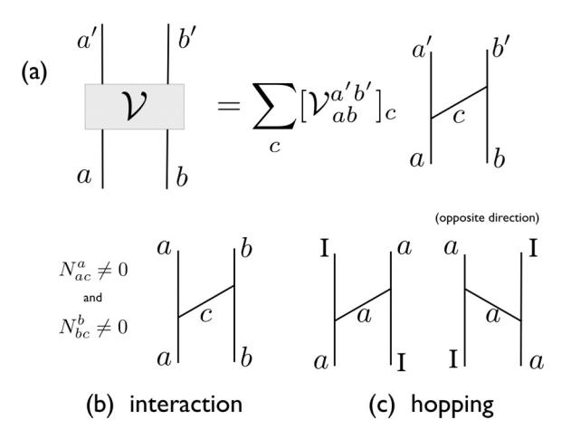

FIG. 3. (a) All two-anyon processes can be represented as a general "tunneling" term, where topological (and/or electrical) charge is transferred from one localized quasiparticle to the other. Special cases of this include (b) an "interaction" between the two anyons, for which the localized charges are unchanged, and (c) a "hopping" term, where a localized anyon moves to a vacant site.

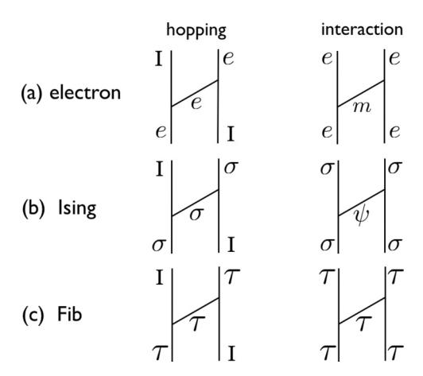

FIG. 4. Hopping and interaction terms for (a) electrons, (b) Ising anyons, and (c) Fibonacci anyons, expressed in the notations used in Fig. 3.

Hubbard model. In order to describe the low-energy spectra, a well-known strategy consists of building up a simpler model by (i) discarding the high-energy (quasi)particles and (ii) treating virtual processes involving the fusion of the low-energy (quasi)particles to the discarded high-energy (quasi)particles in second-order perturbation theory.

### B. Large-U electronic Hubbard model

To illustrate this procedure, we first take the example of a generalized Hubbard model of electrons and show how to derive the corresponding t-J model. We start from electrons, where the most general SU(2)-symmetric single-band model with NN interactions can be written in second quantized notation as

$$H = -t \sum_{i,\sigma} (c_{i,\sigma}^{\dagger} c_{i+1,\sigma} + \text{H.c.})$$

$$+ J_0 \sum_{i} \left( \vec{S}_i \cdot \vec{S}_{i+1} - \frac{1}{4} n_i n_{i+1} \right)$$

$$+ V \sum_{i} n_i n_{i+1} + U \sum_{i} n_{i,\uparrow} n_{i,\downarrow}. \tag{6}$$

Here  $c_{i,\sigma}^{\dagger}$  and  $c_{i,\sigma}$  are the creation an annihilation operators of an electron with z component of spin  $\sigma$ ,  $n_{i,\sigma}=c_{i,\sigma}^{\dagger}c_{i,\sigma}$  are the local spin densities,  $n_i=n_{i,\uparrow}+n_{i,\downarrow}$  is the total local density, and  $\vec{S}_i$  is the spin operator on site i.

The first term (t) in the Hamiltonian Eq. (6) is the hopping (tunneling) of an electron. The second term  $(J_0)$  is a spin exchange term, which can be interpreted as a two-electron interaction mediated by the tunneling of a spin-1 magnon. This term can also be written as  $-J\mathcal{P}_{i,i+1}^{S=0}$ , with  $\mathcal{P}_{i,i+1}^{S=0}$  being the projector onto the total singlet state of two neighboring electrons at sites i and i+1. The third term (V) is an NN repulsion, which can be interpreted as tunneling of a photon, and finally, the last term (U) is the local charging energy.

In this Hubbard model of electrons, we consider three types of "quasiparticles" at the lowest energies: the "trivial particle" I (i.e. a vacant site), the electron e, and the "doublon" d, corresponding to a double (electronic) occupancy at a site. In

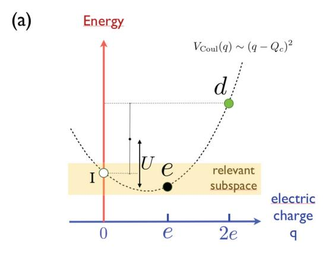

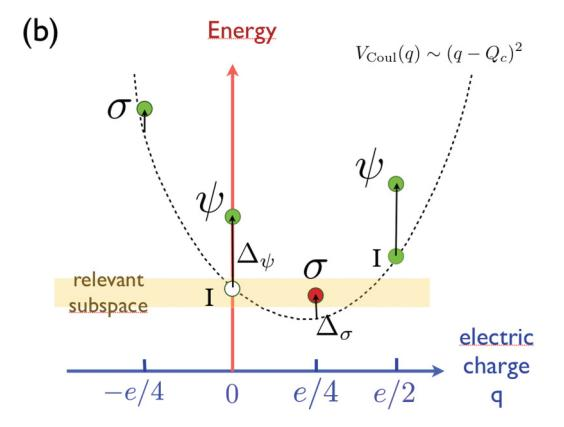

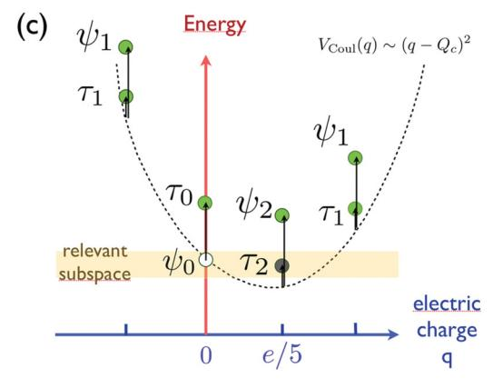

FIG. 5. (Color online) Schematic energy spectra (arbitrary scale) in the presence of a parabolic Coulomb charging energy for the case of (a) electrons, (b) Ising anyons, and (c) Fibonacci anyons. The Hubbard U energy is shown in (a). Upward arrows show the shifts corresponding to the topological contribution to the bare energies of the quasiparticles, e.g.,  $\Delta_{\sigma}=1/8$  and  $\Delta_{\psi}=1$  in (b) and  $\Delta_{\tau_0}=4/5$ ,  $\Delta_{\tau_1}=\Delta_{\tau_2}=2/15$ , and  $\Delta_{\psi_1}=\Delta_{\psi_2}=4/3$  in (c).

Fig. 5(a), we model the energy costs for a given quasiparticle type using a parabolic Coulombic charging energy of the form

$$V_{\text{Coul}}(q) \sim (q - Q_c)^2$$
, (7)

where q is the quasiparticle's electric charge value, and  $Q_c$  is the minimal energy charge value. Here, each lattice site is viewed as a "quantum dot" for which  $Q_c$  is fixed by the (implicit) chemical potential. The last term in the Hamiltonian Eq. (6) specifies that U is the energy cost of promoting two

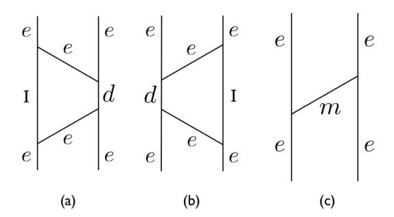

FIG. 6. (a, b) Second-order exchange processes for two electrons at nearest-neighbor sites via the virtual creation of a "vacuum" quasiparticle *I* (i.e., a vacancy) and a "doublon" *d*. These two exchange diagrams can be replaced by the first-order magnon exchange diagram shown in (c), leading to a renormalization of the magnon exchange interaction.

electrons into a vacancy and a doublon. When *U/t* is large, one can project out doublons and consider a restricted subspace of electrons and vacancies only. The local *U* interaction can then be taken into account in second-order perturbation, as shown in Fig. 6, renormalizing the coupling constant of the spin exchange term to *J* = *J*0 + 4*t* 2*/U*, i.e., the magnon-mediated interaction.

#### **C. Hilbert-space truncation for anyons**

For anyons we proceed in the same way as for the electronic Hubbard model to derive a simpler effective model of the low-lying states, assuming that the charging energy is the largest energy scale and can be integrated out. In Figs. [5\(b\)](#page-4-0) and [5\(c\),](#page-4-0) we model the energy costs for a given quasiparticle type using a quantum dot, which, again, has a quadratic Coulombic charging energy *V*Coul(*q*), but also has an energy shift,

$$V_{\rm neut}(a) \propto \Delta_a,$$
 (8)

where *a* is the conformal scaling dimension corresponding to topological charge *a*, which depends on the (neutral) topological charge of the quasiparticle[51](#page-16-0) (see also Refs. [52–55\)](#page-16-0). We note that the conformal scaling dimension *a* is the sum of the left and right conformal weights *a* = *ha* + *h*¯*a*.

For a high charging energy we can restrict ourselves to a low-energy subspace that contains only two quasiparticle types, as indicated in Figs. [5\(b\)](#page-4-0) and [5\(c\).](#page-4-0) In the case of the Ising anyon chain, we only allow the lowest energy quasiparticles (*I,*0) and (*σ,e/*4) to be localized at a given site. The quasiparticles (*I,e/*2) and (*ψ,e/*2) correspond physically to double occupancies of the quasiparticle (*σ,e/*4) and, thus, involve a prohibitively high Hubbard-like charging energy. The neutral fermion quasiparticle (*ψ,*0) is gapped, because of the energy associated with the *ψ* mode, but it is present in our model in the form of virtual tunneling processes. To make the quasiparticles (*I,*0) and (*σ,e/*4) nearly degenerate, one has to introduce a chemical potential, which, combined with the charging energy, gives the sought after near-degeneracy. Similarly, in the case of Fibonacci anyons, we can also allow only the lowest energy quasiparticles (*ψ*0*,*0) and (*τ*2*,e/*5) to be localized at a given site. In this case, the neutral Fibonacci quasiparticle (*τ*0*,*0) is gapped but is present in our model in the form of virtual tunneling processes. In Appendix [A,](#page-15-0) we explain in more detail how one can combine the effects of a gate and of the charging energy in order to obtain a low-energy sector containing two degenerate states, separated from the other excitations by a gap.

We note that the fundamental quasiparticles of the MR or RR quantum Hall states are described as the product of an Ising or Fib anyon model with an Abelian anyon model (see Appendix [A\)](#page-13-0), which can be associated with the electric charge and is, therefore, "additive." Hence, the electric charges of the quasiparticles of the relevant subspace need not be specified any more, because each quasiparticle has the same charge. Also, we can drop the subscripts for the two lowest energy Fibonacci quasiparticles; i.e., we identify *ψ*0 → *I* and *τ*2 → *τ* since only one species of *τ* anyons is involved in the lowenergy subspace. In other words, we end up with only one type of *σ* anyon or *τ* anyon allowed at the sites, and the sites left empty are filled with trivial quasiparticles *I* or vacancies. The details of the above-mentioned identification are not important here but are given in Appendix [B.](#page-15-0)

A pictorial representation of such chains is shown in Fig. [1.](#page-2-0) The charge degrees of freedom can therefore be thought of as living at the sites (the localized nontrivial quasiparticles carry elementary *e/*4 or *e/*5 electric charge, in contrast to the vacancies), while the bond variables *xi* are encoding the anyonic (or spin) degrees of freedom. We recall that *a* × *I* = *a* for any quasiparticle *a* = *I* , *τ* , *σ*, *ψ* so that the anyonic "spin" is conserved along the empty segments of the chain (i.e., with vacancies at the sites).

#### **D. Interaction between nearest-neighbor anyons**

Let us consider putting *N* anyons of type *σ* or *τ* on an *L*-site chain with periodic boundary conditions, i.e., on a closed ring (situated on a torus). When two charged anyons sit at NN sites they experience an ordinary Coulomb repulsion *V* . In addition, they interact via an effective exchange interaction of magnitude *J* , which can be derived as in the electronic Hubbard chain. For this, we use the (unitary) *F*-symbol transformation shown in Fig. 7, which is a change of basis between different fusion tree representations of the states. When we apply the *F* symbol of the NN anyons, which have charges *a* and *b*, it provides a change of basis from the fusion chain basis in Fig. [1](#page-2-0) (which we use to encode states) to one in which the fusion channel of this NN pair of anyons is manifest, as indicated in Fig. 7 by the charge label *w*.

By analogy with the electronic Heisenberg interaction, the exchange interaction between two neighboring anyons is given by −*J*P*I* , which favors the vacuum fusion channel *I* for these two anyons. The actions of the corresponding exchange processes on the local fusion tree basis elements are shown

$$\begin{array}{cccccccccccccccccccccccccccccccccccc$$

FIG. 7. Change of basis involving the fusion channel of two neighboring electrons or anyons and the *F* symbol.

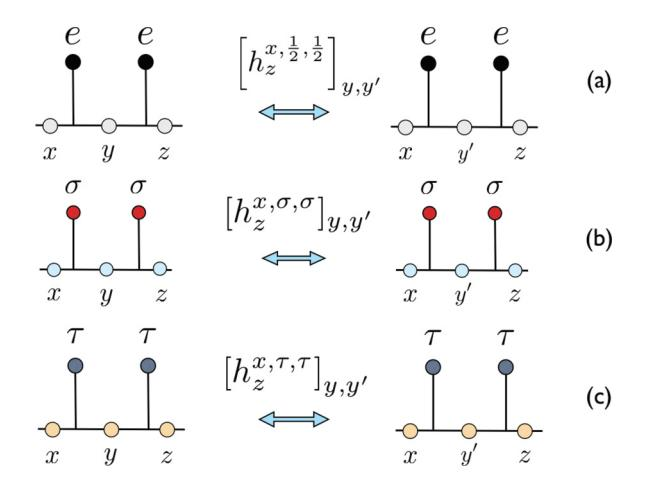

FIG. 8. (Color online) Matrix elements describing (exchange) interactions between nearest neighbors of (a) electrons, (b) Ising anyons, and (c) Fibonacci anyons. In (b), when  $x=z=\sigma$ , y and y' can take the value I or  $\psi$ , making  $h_{\sigma}^{\alpha,\sigma,\sigma}$  a  $2\times 2$  matrix, while when neither x nor z equals  $\sigma$ , then  $y=y'=\sigma$ , making  $h_z^{x,\sigma,\sigma}$  a  $1\times 1$  matrix.

schematically in Figs. 8(a)-8(c). By using the F-symbol change of basis in Fig. 7, the local Hamiltonian elements  $h_{x_{i+1}}^{x_{i-1},\alpha_i,\alpha_{i+1}}$  can be derived, depending on (and labeled by) the variables  $x_{i-1}$  and  $x_{i+1}$  on the two outer bonds connected to the two NN sites and acting on the local spin  $x_i$  of the inner bond, as shown in Figs. 8(a)-8(c). The label  $\alpha_i$  denotes the type of anyon localized at site i. Severe local constraints greatly reduce the number of possible nonzero matrices and matrix elements, which we give explicitly below.

Let us first start with the case of two NN spin-1/2 (localized) electrons experiencing an AF exchange interaction, i.e., for which the fusion outcome in the singlet channel is favored over the triplet channel. In the usual spin basis, this is just the Heisenberg term  $-J(1/4 - \mathbf{S}_i \cdot \mathbf{S}_{i+1})$ . However, we work in the fusion chain basis, as shown in Fig. 1(a). Thus, we need to know the F symbols describing the change of basis as given in Fig. 7, for the case of SU(2) spin-1/2's, i.e.,  $\alpha_i = \alpha_{i+1} = 1/2$ . The F symbols are closely related to the Wigner 6j symbols [see, e.g., Ref. 56 or the SU(2)k F symbols with q = 1 (i.e.,  $k = \infty$ ) in Appendix A]. The F symbols of interest here are given by

$$\left[F_{x_{i+1}}^{x_{i-1},\frac{1}{2},\frac{1}{2}}\right]_{x_i,\tilde{x}_i} = (-1)^{x_{i-1}+x_{i+1}+1} \sqrt{(2x_i+1)(2\tilde{x}_i+1)} \\
\times \begin{cases} x_{i-1} & 1/2 & x_i \\ 1/2 & x_{i+1} & \tilde{x}_i \end{cases}, \tag{9}$$

where  $\tilde{x}_i = 0,1$  is the total spin of the two spin- $\frac{1}{2}$ 's, and  $\{\frac{j_1}{j_1},\frac{j_2}{j_1},\frac{j_{12}}{j_{23}}\}$  denote the 6*j* symbols.

In particular, if  $x_{i+1} = x_{i-1} \pm 1$ , then the values of  $x_i$  and  $\tilde{x}_i$  are fixed to be  $x_i = x_{i-1} \pm \frac{1}{2}$  and  $\tilde{x}_i = 1$ , and the resulting F symbol is just a number, namely,

$$\left[F_{x_{i-1}\pm 1}^{x_{i-1},\frac{1}{2},\frac{1}{2}}\right]_{x_{i-1}\pm \frac{1}{2},1} = 1.$$
 (10)

In the case where  $x_{i-1} = x_{i+1} = 0$ , we must have  $x_i = 1/2$  and  $\tilde{x}_i = 0$ . The associated F symbol is again 1:

$$\left[F_0^{0,\frac{1}{2},\frac{1}{2}}\right]_{\frac{1}{2},0} = 1. \tag{11}$$

The only case for which the F symbol has rank 2 is when  $x_{i-1} = x_{i+1} = s \geqslant \frac{1}{2}$ , giving  $x_i = s \pm \frac{1}{2}$  and  $\tilde{x}_i = 0, 1$ . The F symbol takes the from

$$F_s^{s,\frac{1}{2},\frac{1}{2}} = \frac{1}{\sqrt{2s+1}} \begin{bmatrix} -\sqrt{s} & \sqrt{1+s} \\ \sqrt{1+s} & \sqrt{s} \end{bmatrix}, \tag{12}$$

where the first column corresponds to  $\tilde{x} = 0$ , and the second to  $\tilde{x} = 1$ .

With the knowledge of the F symbols, we can construct the Hamiltonian [see Fig. 8(a)], which symbolically takes the form

$$\left[h_{x_{i+1}}^{x_{i-1},\frac{1}{2},\frac{1}{2}}\right]_{x_{i},x_{i}'} = V\delta_{x_{i},x_{i}'} - J\left[F_{x_{i+1}}^{x_{i-1},\frac{1}{2},\frac{1}{2}}\right]_{x_{i},0} 
\times \left[\left(F_{x_{i+1}}^{x_{i-1},\frac{1}{2},\frac{1}{2}}\right)^{-1}\right]_{0,x_{i}'},$$
(13)

where we have included the coulomb interaction V, because the electrons occupy neighboring sites, and we favor the spin-0 channel (implicitly it is only nonzero if the diagram is allowed by the fusion rules). Explicitly, we find that  $h_{x_{i+1}}^{x_{i-1},1/2,1/2,}=V$  in the case where  $x_{i+1}\neq x_{i-1}$ . For  $x_{i-1}=x_{i+1}=0$ , we have  $h_0^{0,1/2,1/2}=V-J$ , and for s>0, we have

$$h_s^{s,1/2,1/2} = \begin{bmatrix} V - \frac{Js}{2s+1} & \frac{J\sqrt{s(1+s)}}{2s+1} \\ \frac{J\sqrt{s(1+s)}}{2s+1} & V - \frac{J(s+1)}{2s+1} \end{bmatrix}.$$
(14)

The Hamiltonian in the case of Ising and Fibonacci anyons [see Figs. 8(b) and 8(c)] is obtained in the same way as we did above for spin-1/2 electrons. The most important necessary ingredient is the F symbols, which can be found in Appendix A.

For Ising anyons, the nonzero matrix elements are limited to

$$\left[h_I^{I,\sigma,\sigma}\right]_{\sigma,\sigma} = \left[h_{\psi}^{\psi,\sigma,\sigma}\right]_{\sigma,\sigma} = V - J,\tag{15}$$

$$\left[h_{\psi}^{I,\sigma,\sigma}\right]_{\sigma,\sigma} = \left[h_{I}^{\psi,\sigma,\sigma}\right]_{\sigma,\sigma} = V,\tag{16}$$

and

$$h_{\sigma}^{\sigma,\sigma,\sigma} = \begin{bmatrix} V - J/2 & -J/2 \\ -J/2 & V - J/2 \end{bmatrix},\tag{17}$$

where the basis used to write the matrix is  $\{I, \psi\}$ .

The nonzero matrix elements of the Fibonacci chain are given by

$$\left[h_I^{I,\tau,\tau}\right]_{\tau,\tau} = V - J,\tag{18}$$

$$\left[h_{\tau}^{I,\tau,\tau}\right]_{\tau,\tau} = \left[h_{I}^{\tau,\tau,\tau}\right]_{\tau,\tau} = V,\tag{19}$$

and

$$h_{\tau}^{\tau,\tau,\tau} = \begin{bmatrix} V - J/\phi^2 & -J/\phi^{3/2} \\ -J/\phi^{3/2} & V - J/\phi \end{bmatrix}, \tag{20}$$

where  $\phi$  is the golden ratio and the matrix is written in the basis  $\{I, \tau\}$ .

## E. Anyon "hopping"

Finally, we have to consider the possibility of quasiparticles (including the vacuum I) moving on the lattice and gaining

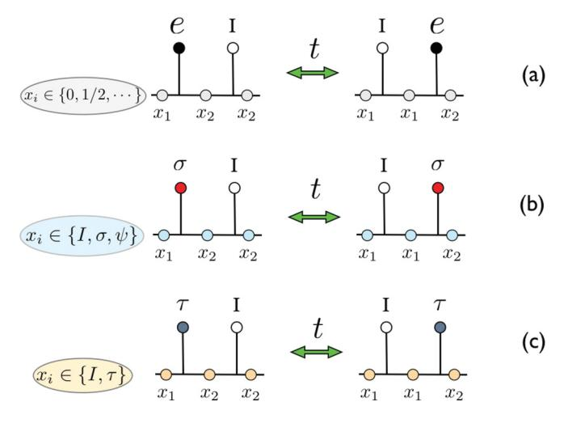

FIG. 9. (Color online) Tunneling process (or "hopping") of (a) an electron, (b) an Ising anyon, and (c) a Fibonacci anyon.

kinetic energy. The (effective) physical hopping processes are shown in Fig. 9. In such a move, the entire quasiparticle, including the electric charge and spin/topological charge, is transported from one lattice site to a vacant site that is adjacent to it. (Generally, hopping may involve transfer of a quasiparticle to an occupied site, but we do not consider such processes in our models.) Note that the magnitude of the hopping *t* is not affected by the truncation of the Hilbert space to the reduced space of the low-energy quasiparticles. Note also that the sign of *t* is irrelevant, so one can assume *t >* 0 for simplicity.

When |*J* | is large in comparison to *t* and *V* , the system phase-separates, i.e., the anyons tend to form large clusters of higher density, *ρ* 1. In contrast, for a higher kinetic energy (i.e., *t*) and/or repulsion between the anyons, the system remains homogeneous. This is the regime of interest here, and for *ρ* = 2*/*3 and *ρ* = 1*/*2, we have found that it is realized for *t* = |*J* |, even when *V* = 0, or larger *t/*|*J* | values. Note that, for convenience, we assume *V* = 0 throughout and we have explored the models for values of *J* ranging from −*t* to *t*.

# **IV. CHARGE DEGREES OF FREEDOM FOR** *J* **= 0**

This section is a "warmup" for the real itinerant anyon models, starting with the simple example of identical bosons, and describes how making them distinguishable introduces a twist in the periodic boundary conditions. It therefore explains the *J* = 0 part of the spectra, without the non-Abelian complications.

## **A. Hard-core bosons**

We start with a periodic chain of size *L* filled with *N* bosons. We consider the case where two bosons cannot occupy the same site, due, e.g., to an infinite on-site repulsion (hardcore constraint). Such a system of hard-core bosons (HCBs) can be mapped via a Holstein-Primakoff and Jordan-Wigner transformation onto a gas of spinless fermions. In 1D, the effect on the spectrum due to the difference in statistics can simply be accounted for by adding to the fermions an extra phase shift of *π* through the ring (when the particle number

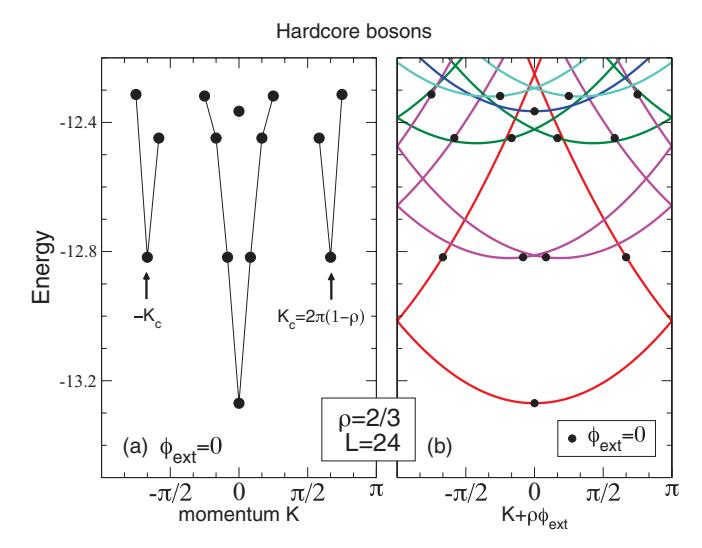

FIG. 10. (Color online) Spectra of 16 (hardcore) bosons moving on a 24-site chain with periodic boundary conditions. (a) Spectrum for zero magnetic flux through the ring. The linear dispersions vs momentum *K* are shown at *K* = 0 and *K* = ±*Kc*. (b) Spectrum vs external (continuous) magnetic flux *φ*ext (multiplied by the density *ρ*). Each discrete level [filled (black) circles] leads to a (parabolic) branch of excitations.

*N* = *ρL* is even). Therefore, the HCB many-body spectrum can be obtained by filling up *N* states of a (fermionic) cosine band,

$$E_{\text{HCB}}(p) = -2t \sum_{j(p)} \cos \left[ \frac{2\pi}{L} \left( j + \frac{1}{2} \right) \right], \tag{21}$$

where {*j* (*p*)} is a set (labeled by *p*) of an even number *N* of different integers and the momenta are all shifted by *π/L*. The spectrum (for *t* = 1) is displayed in Fig. 10(a). As expected, the HCB spectra exhibit linear quasiparticle dispersions centered at momenta *K* = 0 and *K* = *Kc* ≡ 2*πρ* [or 2*π*(1 − *ρ*) for *ρ >* 1*/*2].

For later use in the case of anyons, it is of interest to introduce an external magnetic flux *φ*ext or, equivalently, an Abelian U(1) flux through the ring. The new spectrum *E*HCB(*p,φ*ext) depends now on both discrete and continuous variables *p* and *φ*ext,

$$E_{\text{HCB}}(p,\phi_{\text{ext}}) = -2t \sum_{j(p)} \cos \left[ \frac{2\pi}{L} \left( j + \frac{1}{2} \right) + \frac{\phi_{\text{ext}}}{L} \right], \quad (22)$$

plotted in Fig. 10(b) (for *t* = 1).The state labeled (*p,φ*ext) now carries an arbitrary (continuous) total momentum *K*˜ = *Kp* + *ρφ*ext, with *Kp* = 2*π L j* (*p*) (*j* + 1 2 ).

## **B. Fermions and anyons**

We now make the (quasi)particles *distinguishable*; i.e., we introduce some internal degrees of freedom, which can be, e.g., the spin-1*/*2 components of the electrons or the anyonic degrees of freedom of the Ising *σ* or Fibonacci *τ* anyons. The resulting model is the same as considering the above *t*-*J* models in the limit where *J* = 0 (*t* can be set to 1). This limit, where the energy scale of the anyonic degrees of freedom is set to 0, is of great interest since it provides insight on the nature of the charge excitations.

In that limit, mobile anyons are expected to still behave as HCBs. However, the extra internal degrees of freedom (with a zero energy scale) should provide extra features on top of the HCB spectrum. Because of the anyonic (or spin) degrees of freedom linked to them the charged bosons are no longer indistinguishable particles, and on a torus or a ring, hopping of a particle across the "boundary" cyclically translates the labels of the fusion tree. To recover the same labeling, in general, all N particles must be translated over the boundary. Thus, one distinguishable particle hopping over the boundary has the same effect as a phase shift  $\phi_n = 2\pi \frac{n}{N}$  (with n an integer). Hence the complete J = 0 electronic/anyonic spectrum (at zero external flux) is given by the union of all HCB spectra taken at all discrete values of  $\phi_n$ :

$$E_{\text{charge}}^{p,n} = E_{\text{HCB}}(p,\phi_n). \tag{23}$$

A momentum shift is induced by the U(1) flux, given by  $\rho \phi_n$ , i.e.,  $2\pi \frac{n}{L}$ , an integer multiple of  $\frac{2\pi}{L}$ . The states then carry (discrete) total momenta,

$$K_{p,n} = K_p + 2\pi \frac{n}{I},$$
 (24)

where  $K_p$  are the momenta of the HCB eigenstates at  $\phi_{\rm ext} = 0$ . For convenience, one can distribute the phase shift equally on the bonds to preserve translational invariance, and one gets

$$E_{\text{charge}}^{p,n} = -2t \sum_{j(p)} \cos \left[ \frac{2\pi}{L} \left( j + \frac{1}{2} + \frac{n}{N} \right) \right]. \tag{25}$$

Spectra for Ising and Fibonacci anyons obtained by exact diagonalization (ED) for J = 0 are shown in Figs. 11, 12(a), and 12(b). As expected, Eq. (25) matches exactly the numerical ED results. From the above considerations, it is then clear

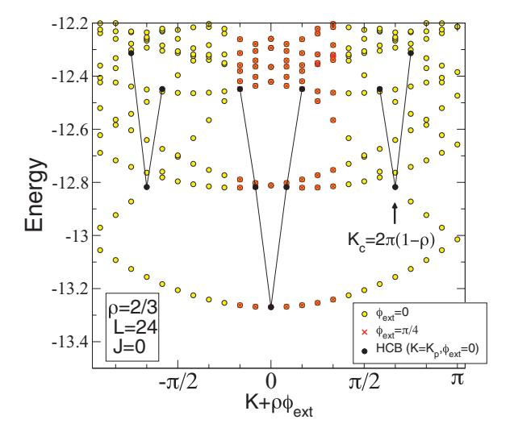

FIG. 11. (Color online) Low-energy spectrum of a 24-site t-J chain at J=0 and density  $\rho=2/3$ , obtained numerically using Ising anyons. Yellow circles correspond to the spectrum at  $\phi_{\rm ext}=0$  as a function of momentum K. The "parent" charge excitations (HCB at  $\phi_{\rm ext}=0$ ) are shown by filled (black) circles. Adding an external flux  $\phi_{\rm ext}$  through the ring is equivalent to shifting K by  $\rho\phi_{\rm ext}$ : the (red) crosses correspond to the spectrum at  $\phi_{\rm ext}=\pi/4$  restricting  $K\in [-\pi/3,\pi/6]$  (so that  $\tilde{K}\in [-\pi/6,\pi/3]$ ).

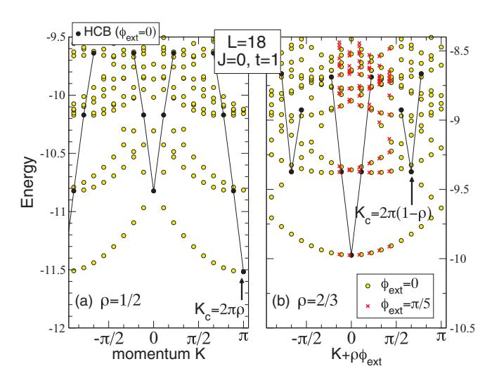

FIG. 12. (Color online) Low-energy spectra vs momentum K of an 18-site t-J chain with J=0 at anyon densities of (a)  $\rho=1/2$  and (b)  $\rho=2/3$ . The notations here are the same as in Fig. 11, but these results were obtained numerically using Fibonacci anyons. The low-energy spectra of the 18-site HCB chain at the same densities (parent excitations) are shown by filled (black) circles. Data for an external flux  $\phi_{\rm ext}=\pi/5$  are shown in (b). The minimum of the spectrum occurs at momentum K=0 or  $K=\pi$ , depending on the parity of the number  $N=\rho L$  of quasiparticles.

that the eigenenergies lie exactly on top of the parabolas corresponding to the "optical" excitations of the HCB. In other words, each state in the HCB spectrum is extended into a discrete set of levels on a parabola—the same parabola that one gets by adding flux (an Abelian phase), as checked numerically.

It is important to note that the J=0 spectrum does not depend on the internal degrees of freedom or, hence, on the nature of the quasiparticles, i.e., whether they are electrons, Ising anyons, Fibonacci anyons, or distinguishable bosons. However, the respective Hilbert spaces are very different, which means that the corresponding eigenfunctions and degeneracies differ completely. In addition, the way the very large degeneracy of each level is lifted by any finite exchange interaction (see Fig. 14 discussed later) depends crucially on the type of particles.

## C. External magnetic flux

When the anyons experience an arbitrary external flux  $\phi_{\rm ext}$ , the above formula can be generalized to  $E_{\rm charge}^{p,n}(\phi_{\rm ext})=E_{\rm HCB}(p,\phi_n+\phi_{\rm ext})$ . It then becomes apparent that the J=0 energy spectrum does not depend on the momentum  $K_{p,n}$  and external flux  $\phi_{\rm ext}$  separately but, rather, only on the "pseudomomentum" combination  $\tilde{K}=K_{p,n}+\rho\phi_{\rm ext}$ . Hence, one can define a spectrum depending on both discrete and continuous variables:

$$E_{\text{charge}}(p, \Phi) = E_{\text{HCB}}(p, \Phi).$$
 (26)

The curvature of the ground-state energy  $\partial^2 E_{\text{charge}}(0,\Phi)/\partial\Phi^2$  is directly proportional to the optical (Drude) weight quantifying the potential of this system to conduct.

### V. DENSE ANYON MODELS

To complete the warmup to describe the full anyonic t-J model, we briefly discuss dense anyon models at  $\rho = 1$ . These models have precisely one anyon per site, which are, hence, immobile due to the hard-core constraint. Every anyon interacts with its two neighbors, and only the sign of the interaction strength J is relevant. These models, introduced in Ref. 57, are the anyonic versions of the Heisenberg spin chains. We consider only the spin-1/2 versions in this paper.

In the case where only an NN two-body interaction is present, the spin-1/2 anyonic chains are all critical, and their energy spectra are described by well-known conformal field theories (CFTs). Starting with the Ising anyons, we note that, due to the fusion rules, the degrees of freedom on the fusion chain are forced to form a pattern of alternating frozen  $\sigma$  bonds and bonds fluctuating between I and  $\psi$ . For these later bond variables, the interactions of Fig. 7(c) are exactly those of a critical Ising model in transverse field, whose corresponding CFT has central charge c = 1/2. This is irrespective of the overall sign of the interaction, although the momenta at which the various states occur differ depending on the sign of J.

In the case of Fibonacci anyons, changing the sign of J does alter the critical behavior of the chain. In the case of antiferromagnetic interactions (favoring the trivial fusion channel of two neighboring Fibonacci anyons), the critical behavior is described in terms of the c=7/10 tricritical Ising model, with low-lying, linearly dispersing modes occurring at momenta K=0 and  $K=\pi$ . For ferromagnetic interactions, the critical behavior is instead described by the c=4/5 three-state Potts model, which exhibits low-lying modes at  $K=0,2\pi/3,4\pi/3$ .

The behavior described above can be obtained by mapping the models onto exactly solvable two-dimensional height models, introduced by Andrews, Baxter, and Forrester.58 The result for spin-1/2 anyons associated with  $SU(2)_k$  is that, in the case of antiferromagnetic interactions, the critical behavior of the chain is given in terms of the k-critical Ising model, while ferromagnetic interactions give rise to the critical behavior of the  $\mathbb{Z}_k$  parafermions.

We would like to stress that, although one can analytically obtain the critical behavior of the dense anyonic chains, it is not possible to obtain the energy spectra in full detail for finite-size systems for  $k \ge 3$ . To obtain these, one must employ numerical techniques, such as ED (see, e.g., Fig. 13, for the k=2 Ising case, which can also be obtained exactly). In describing the full spectra of anyonic t-J models, we make use of the spectra of the dense anyonic models described here, as obtained from ED.

We denote the length of the dense anyon chains  $L_a$ . The energies of the dense anyon chains are denoted  $E_{\rm anyon}(m)$ , where the integer m labels the eigenstates, which have momenta  $k_m$  that are integer multiples of  $2\pi/L_a$ . Next, considering chains of length L and at anyon densities  $\rho < 1$ , we define the corresponding "squeezed chains" of dense anyons of length  $L_a = \rho L = N$ , in which the vacancies (or trivial quasiparticles) have been removed.

## VI. MANY-BODY SPECTRA OF ANYONIC t-J MODELS

Having described the spectra of the HCB system, in the presence of external flux, as well as the spectra of dense anyon

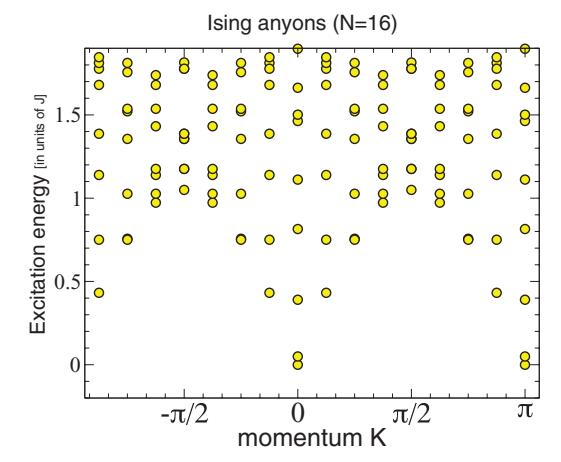

FIG. 13. (Color online) Energy spectrum of a dense Ising-anyon chain ( $\rho = 1$ ) of length  $L_a = 16$ . The ground-state energy has been subtracted.

models, we are now ready to describe the spectra of the full, itinerant anyon models. We label the various energies  $E_{p,m}$ , where the labels p and m refer to the (renormalized) HCB spectrum and the dense anyon chain, respectively. We also explain the subtle coupling of the momenta.

## A. Separation of charge and anyonic degrees of freedom

We now consider the full J>0 spectra of the itinerant models. We solve the effective anyonic models on small periodic rings using exact diagonalization. For Ising anyons, a 24-site chain is studied at density  $\rho=2/3$  (N=16 quasiparticles). For Fibonacci anyons (which have a larger

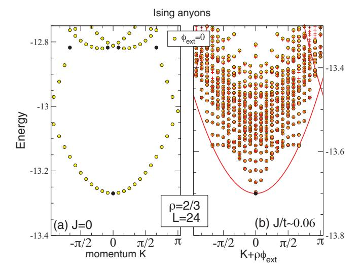

FIG. 14. (Color online) A zoom-in on the low-energy spectra vs K of a 24-site Ising anyon t-J chains at density  $\rho=2/3$  for (a) J=0 and (b) the small value of  $J/t=\tan{(\pi/50)}\simeq 0.06$ . The Lanczos algorithm with 800 iterations is used so that, in the energy window shown, most of the eigenenergies have converged to within a relative error of  $10^{-16}$  (a few not fully converged levels are not shown). The (red) crosses correspond to the sum of the (computed) lowest charge branch [solid (red) line] with *all* the expected anyonic excitations. See text for more details.

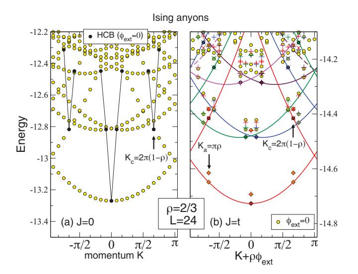

FIG. 15. (Color online) Low-energy spectra vs *K* of a 24-site Ising *t*-*J* chain at density *ρ* = 2*/*3 for (a) *J* = 0 and (b) *J* = *t* = 1*/* √2. Data at *φ*ext = 0 are shown by shaded (yellow) circles. Parent charge excitations are shown by filled (black) circles (*φ*ext = 0) and, as a function of pseudomomentum *K*˜ = *K* + *φ*ext*ρ* (varying *φ*ext), by solid lines of different colors. The cross and X symbols added for comparison correspond to the sum of the charge and expected anyonic excitation spectra. (See text for more details.) The colors of these symbols are the same as their *parent* charge excitation parabolas.

Hilbert space) we consider an 18-site chain at density *ρ* = 1*/*2 (*N* = 9 quasiparticles) and *ρ* = 2*/*3 (*N* = 12 quasiparticles). We choose |*J* | *t*, for which the system remains uniform and does not phase separate (which occurs for larger *J* ). Note that the sign of *J* is irrelevant for the energy levels in the case of Ising anyons, though the momenta at which the various states occur differ depending on the sign of *J* .

The low-energy spectra (|*J* | = *t* = 1*/* √2) of the itinerant Ising and Fibonacci anyonic chains are shown in Figs. 15(b), 16(a), and 16(b), respectively. These seem very different from the *J* = 0 limit studied above [and shown again in Fig. 15(a) for comparison]. To understand such spectra, let us first consider a zoom-in on the low-energy region and compare the spectra at *J* = 0 and at a small value of *J* , as shown in Figs. [14\(a\)](#page-9-0) and [14\(b\).](#page-9-0) This reveals that the *highly degenerate J* = 0 charge excitation parabola is being split by the magnetic interaction into a complex spectrum with a spread in energy proportional to *J L*. When *J* ∼ *t/L*2, the spectra originating from each parabola start to overlap as expected in Figs. 15(b), 16(a), and 16(b). Despite the apparent complexity of the *J* = 0 spectrum, we shall be able to express all excitations as the sum of an anyonic excitation and a charge excitation, extending the concept of spin-charge separation familiar for 1D correlated electrons to the case of a 1D anyonic interacting system. To complete this task, we first establish from simple considerations the "recipes" to construct separately the expected charge and anyonic spectra. In the second step, we show how the numerical spectra of the *t*-*J* anyonic chains can be seen as a subtle combination of the above two spectra.

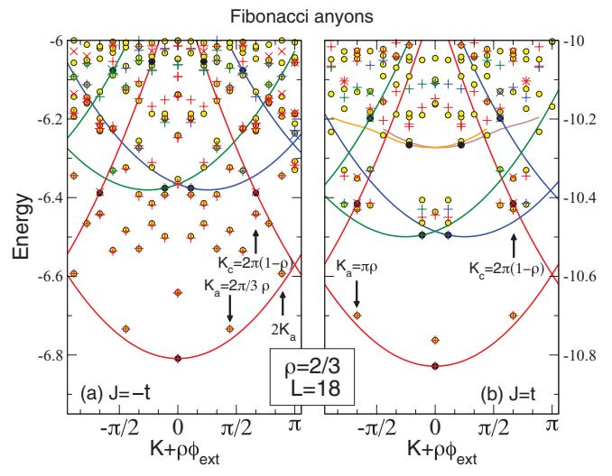

FIG. 16. (Color online) Low-energy spectra vs *K* of an 18-site Fibonacci *t*-*J* chain at density *ρ* = 2*/*3 and |*J* | = *t* = 1*/* √2 for both (a) *J <* 0 and (b) *J >* 0. Data at *φ*ext = 0 are shown by shaded (yellow) circles. Parent charge excitations are shown by filled (black) circles (*φ*ext = 0) and, as a function of pseudomomentum *K*˜ = *K* + *ρφ*ext (varying *φ*ext), by solid lines of different colors. The cross and X symbols added for comparison correspond to the sum of the charge and (expected) anyonic excitation spectra (see text). The color of these symbols is the same as their *parent* charge excitation parabolas.

The Bethe ansatz result[s59–61](#page-16-0) for the *J* → 0 *electronic t*-*J* chain suggest that the anyonic contributions, *E*anyon(*m*), to the excitation spectrum of the itinerant anyon chain are those of the *squeezed* periodic chain of localized anyons produced by removing all vacant sites, which has the resulting length *La* = *N* = *ρL*. Here, the integer *m* labels the eigenstates of momenta *km*, which are multiples of 2*π/La*. Such a spectrum can be computed separately by ED and agrees very well with the CFT predictions, even on small chains (*La* = 12*,*16). In particular, it shows a (linear) zero-energy mode at zero momentum and at a characteristic momentum *ka*, where *ka* = *π* for Ising and *J >* 0 Fibonacci chains and *ka* = 2*π/*3 for *J <* 0 Fibonacci chains. The coupling constant providing the scale of the anyon spectrum is expected to be weakly renormalized from *J* to *γ J* in the doped system, where *γ* is a factor of order 1 that is to be adjusted as we describe below.

To construct the expected charge excitation spectrum at finite *J* , we use our understanding of the charge excitations in the *J* = 0 limit. Starting from *J* = 0 and turning on *J* gradually, one can *a priori* adiabatically follow the original ( = 0) HCB excitations evolving in, what we call, the *parent* charge excitations at *J* = 0 (labeled by the same integers *p* and at the same momenta *Kp*). As for *J* = 0, changing the momentum *K* of a charge excitation amounts to introducing a total phase shift (or flux) = *K/ρ*. Hence, by introducing "twisted boundary conditions" one can *compute* numerically the (almost-parabolic) branch of excitations *E*˜ charge(*p,*) associated with each parent excitation (labeled *p*). Note that each branch is "renormalized" by *J* so that, strictly speaking, the charge spectrum is no longer associated with *noninteracting* spinless fermions (i.e., with HCBs) and, hence, is no longer given by a simple analytic expression as in Eq. (26). However, if different parent states lie on the same branch, they are still exactly spaced apart by integer multiples of  $\Delta \Phi = 2\pi$ , i.e.,  $\tilde{E}_{\text{charge}}(p,\Phi) = \tilde{E}_{\text{charge}}(p',\Phi+2k\pi)$ , where  $K_{p'} - K_p = 2k\rho\pi$ , for some integer k.

We now explain how to construct the full excitation spectrum by simply considering that (i) the charge degrees of freedom are subject to a phase shift in the boundary conditions and (ii) the anyonic degrees of freedom are the ones of the *squeezed* periodic anyonic chain. According to the above arguments, the energy excitation spectrum should be given by adding the two contributions,

$$E_{p,m} = \tilde{E}_{\text{charge}}(p, k_m) + E_{\text{anyon}}(m). \tag{27}$$

A natural prescription is to simply add the momenta:  $K = K_p + \rho k_m$ . In other words, we assume that the phase shift experienced by the charged "holons" coincides with the total momentum  $k_m = \frac{2\pi n_m}{L_a}$  (where  $n_m$  is an integer) of the anyonic eigenstates defined on the squeezed (undoped) chain. These rules for adding charge and anyonic momenta are therefore assumed to be similar to the  $J \to 0$  Bethe ansatz.

We now wish to verify that proper assignments of the true energy levels according to the form given by Eq. (27) can indeed be made accurately. First, we consider adding a very small exchange coupling J, which lifts the very large degeneracy of the low-energy parabola of the HCBs (see Fig. 14). For finite J the first charge branch (with  $E_{\rm anyon}=0$ ) originating from the zero-momentum ground state of the model (which we assign p=0) can be computed by adding an Abelian flux to the system. It is then possible to construct the expected set of combined charge plus anyon excitations  $E_{0,m}$  by adjusting the renormalization factor  $\gamma$  to get the best fit to the exact low-energy levels. Although there is only one free parameter, it is remarkable that all anyon excitations above the lowest charge parabola can be assigned very accurately as shown in Fig. 14(b).

When  $|J| \sim t$ , charge and anyonic excitations have the same energy scale and one must proceed step by step, sequentially constructing the sets of levels corresponding to increasing charge index p. The two "secondary" parent charge excitations, corresponding to exact eigenstates of the system with momenta  $K_p = \pm K_c$  (p = 1,2), lie on the same p = 0branch, as shown in Figs. 15(b), 16(a), and 16(b). These states lead to the secondary level of combined excitations  $E_{1,m}$  and  $E_{2,m}$ , with no further adjustable parameter. Recall that  $K_c = 2\pi \rho$  for  $\rho \leq 1/2$  and  $K_c = 2\pi (1 - \rho)$  for  $\rho > 1/2$ . Next, in the second step, we identify the lowest not yet assigned excitations at momenta  $K_p = \pm 2\pi/L$  as the subsequent pure charge excitations (and assign them the labels p = 3,4). Following these levels adiabatically under the addition of a flux enables us to construct the corresponding charge branches and locate the secondary pure charge excitation at momenta  $K_p = \pm (2\pi/L + K_c)$  (called p = 5,6). Then, as before, the combined excitations  $E_{p,m}$ , p = 3, ..., 6, can be constructed. One can repeat this procedure (going up in energy) until the level density and the number of charge branch

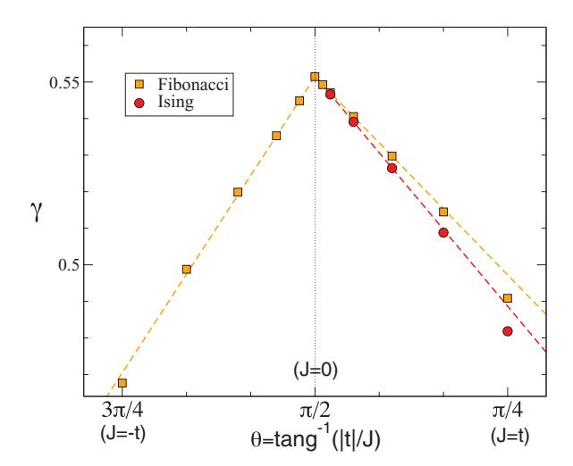

FIG. 17. (Color online) Renormalization parameter  $\gamma$  of the energy scale of the anyonic degrees of freedom for Ising and Fibonacci anyons at  $\rho=2/3$ , computed on L=24 and L=18 chains, respectively.

crossings becomes too large to make precise assignments. In practice, we have identified up to p=11 pure charge excitations and their corresponding low-energy combined anyonic-charge excitations for the Ising chain, as shown in Fig. 15(b). For Fibonacci chains, we have identified up to p=9 pure charge excitations and their corresponding low-energy combined anyonic-charge excitations, as shown in Figs. 16(a) and 16(b).

Our results show that the anyonic energy spectrum is basically given by the same type of Bethe ansatz as for the electronic t-J model (in the  $J/t \rightarrow 0$  limit)59,60 and, in particular, (i) the J = 0 charge excitation spectrum is exactly the same, (ii) the spin excitations also correspond to the squeezed localized chain, and (iii) the rules for adding charge (holon) and spin/anyon momenta are identical. In addition, the numerical spectra agree very well with the sum of the spin (provided some renormalization  $\gamma$  of the energy scale, as shown in Fig. 17) and charge spectra (constructed independently) with the above-mentioned rule for momentum conservation. We believe the small deviations can be attributed to finite-size effects (which vanish when  $J/t \to 0$ ). Interestingly, the  $J \to 0$ limit of the renormalization parameter  $\gamma$ ,  $\gamma(0) \simeq 0.5515$  for  $\rho = 2/3$ , is independent of the anyon type (as the J = 0charge excitation spectrum). In fact, in this limit, it should only depend on the probability of having two neighboring anyons.

## B. Anyonic and charge collective excitations

Due to the above decoupling, the collective anyonic and charge excitations can be deduced easily from the above excitation spectra, by just applying selection rules. Charge excitations occur between different charge branches at constant m with energy transfer

$$\mathcal{E}_{p',p;m} = \tilde{E}_{\text{charge}}(p',k_m) - \tilde{E}_{\text{charge}}(p,k_m)$$
 (28)

and momentum transfer  $K = K_{p'} - K_p$ . Anyonic excitations are characterized by  $\Delta p = 0$  and are then given by

$$\mathcal{E}_{p;m',m} = E_{\text{anyon}}(m') - E_{\text{anyon}}(m) + \tilde{E}_{\text{charge}}(p, k_{m'}) - \tilde{E}_{\text{charge}}(p, k_m), \qquad (29)$$

with momentum transfer  $K = \rho(k_{m'} - k_m)$ . Note that the last two terms in Eq. (29) give a finite-size correction in the energy of order  $1/L^2$ . In the thermodynamic limit, zero-energy anyonic excitations occur at momentum  $K_a = \rho k_a$  (and  $2K_a$  if different), where  $k_a$  is the characteristic momentum (introduced above) of the zero-energy mode of the pure chain. The locations of both charge and anyonic zero-energy modes are indicated in Fig. 15(b) for Ising anyons and in Figs. 16(a) and 16(b) for Fibonacci anyons.

### C. Form of the eigenstates

We now discuss briefly the structure of the eigenfunctions. Equation (2.14) in Ref. 59 established that the ground state of the  $J \rightarrow 0$  limit of the electronic t-J chain can be written exactly as the product of a charge HCB wave function times a spin wave function identical to the ground state of the 1D S = 1/2 Heisenberg model. Our results suggest that a similar product structure might in fact also hold in the case of *all low-energy eigenstates* of 1D non-Abelian anyons at  $J \neq 0$ , up to *finite-size corrections*. We speculate that the eigenfunctions can be approximately written as

$$\Psi_{p,m}(y_1, \dots, y_N; x_1, \dots, x_N)$$

$$\simeq \tilde{\Phi}_{\text{charge}}^p(y_1, \dots, y_N) \chi_{\text{anyon}}^m(x_1, \dots, x_N), \qquad (30)$$

where  $y_j$  are the position of the (site) anyons on the L-site chain and  $x_i$  are the bond variables associated with them (see Fig. 1). Here,  $\tilde{\Phi}_{\text{charge}}^p$  are the eigenstates (labeled p) of an *interacting* L-site HCB chain in the presence of a twist (i.e., flux)  $k_m$  in the boundary conditions and  $\chi_{\text{anyon}}^m$  are the eigenstates (labeled m) with momentum  $k_m$  of the interacting (undoped) anyonic chain of  $L_a = \rho L$  sites.

# VII. DMRG STUDY OF THE MODEL

We can use DMRG to compute the resulting CFT central charge from the analysis of the von Neumann entanglement entropy of an open chain (of length L) cut into two subsystems. We focus here on the case of a diluted Fibonacci t-J chain with  $\rho=2/3$  and J>0, for which we expect the anyonic part to be described by a c=7/10 tricritical Ising CFT. In Fig. 18, we plot the ground state's entanglement entropy

$$S_A = S_B = -\text{Tr}[\rho_A \log \rho_A] \tag{31}$$

between subsystem A and subsystem B, which are two connected segments of the open chain, as a function of the position of the cut along the chain. The calculation is somewhat nonstandard (compared to usual spin systems) because the anyonic fusion tree bond variable  $x_j$  labeling the jth link, which connects the two subsystems, i.e., the link across which one "cuts" the system in two, is shared by both subsystems of the chain. This shared link variable characterizes the overall topological charge of each subsystem. The reduced density

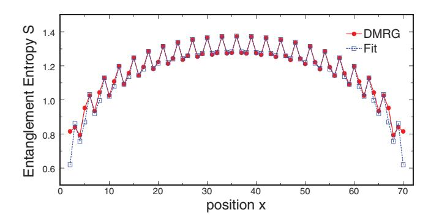

FIG. 18. (Color online) Entanglement entropy obtained using DMRG for an open chain of length L=72, with N=48 Fibonacci anyons and J/t=0.3. The entanglement entropy predicted for a CFT with central charge c=1.7 is plotted and the agreement is seen to be excellent.

matrices

$$\rho_A = \text{Tr}_B \rho, \quad \rho_B = \text{Tr}_A \rho \tag{32}$$

of subsystems A and B are block diagonal with respect to this variable; i.e.,

$$\rho_A = \bigoplus_{x_i} p_{x_i} \rho_{A, x_j}, \tag{33}$$

where  $p_{x_j} = \text{Tr}[\Pi_{x_j}\rho]$  is the probability that the state will have topological charge  $x_j$  on the jth link, and  $\rho_{A,x_j} = \frac{1}{p_{x_j}}\text{Tr}_A[\Pi_{x_j}\rho]$  is the reduced density matrix for subsystem A after projecting the jth link's variable onto the value  $x_j$ .

In order to verify that this Fibonacci t-J chain results in a CFT with central charge c = 1.7, we fit to the formula 62-67

$$S(j) = a + b p_{x_j = \tau} + \frac{c}{6} \log \left[ L \sin \left( \frac{\pi j}{L} \right) \right], \quad (34)$$

where a and b are fitting parameters. The first term is a nonuniversal constant, which can include universal contributions, such as a boundary entropy. The second term is a phenomenologically motivated correction that is proportional to a local kinetic energy, i.e.,  $p_{x_j=\tau}=\langle n_{\rm link}(j)\rangle$ , where  $n_{\rm link}(j)$  is the density (occupation) operator of the jth link, and can include a contribution due to the boundary between the two subsystems. The third term is derived from CFT. We find the best fit for the parameter values a=0.31185 and b=-0.35547. As shown in Fig. 18, the agreement between the numerical results and the values provided by this expression is excellent.

## VIII. CONCLUSION AND OUTLOOK

Motivated by the possible realization of non-Abelian Ising and Fibonacci quasiparticles in quantum Hall states and Majorana heterostructures and the importance of understanding their edge modes, we have investigated what happens if itinerant and interacting (charged) non-Abelian anyons are confined on a 1D chain, subject to a strong charging energy. Following a standard procedure for strongly correlated electronic systems, we have constructed simple low-energy effective models by truncating the Hilbert space to the relevant low-energy particles. Integrating out the high-energy virtual

processes yields an "exchange" interaction between anyons, which physically favors a particular fusion channel. The effective model generically takes the form of an anyonic t-J model, containing the exchange interaction (J) and the rate (t) of anyon "hopping" between nearest-neighbor sites. The central result of our work is that anyons fractionalize into their charge and (neutral) anyonic degrees of freedom. This phenomenon closely resembles and generalizes the well-known spin-charge separation in electronic Luttinger liquids. Incidentally, the numerically verification based on the identification of the many-body levels turned out to be more transparent for anyons, due to the absence of marginally irrelevant operators in the field theory description. The anyon fractionalization justifies a posteriori the treatment of the edge theories of these topological phases as a direct product of the charge and neutral non-Abelian modes, even though the electric charge is not localized in current setups.

We note that the 1D electronic t-J model exhibits an exact supersymmetric point43,44 at which the full excitation spectrum can be obtained using the Bethe ansatz.45 It is left for future studies to investigate whether such an integrable point also exists in 1D anyonic t-J models.

Our simple description of interacting itinerant anyons now enables the investigation of realistic setups for manipulating and/or braiding anyons for future quantum computation. It is also easy to extend this study to quasi-1D systems with more than a single conduction channel: anyonic t-J "ladders" could mimic such a case, following the procedure for localized non-Abelian anyons. Whether fractionalization survives in two spatial dimensions is another important issue. Localized anyons were shown to nucleate into a novel *gapped* quantum liquid  $^{69-72}$  in two dimensions and a similar scenario might take place for itinerant anyons, with, e.g., the anyonic degrees of freedom becoming gapped.

## **ACKNOWLEDGMENTS**

D.P. acknowledges support by the French Research Council (Agence Nationale de la Recherche) under Grant No. ANR 2010 BLAN 0406-01 and by the Paulicenter (ETH-Zürich). This work was granted access to the HPC resources of CALMIP under allocation 2012-P1231. D.P. is also grateful to Nicolas Renon at CALMIP (Toulouse, France) and to SGI (France) for support in the use of the Altix SGI supercomputer. A.F. acknowledges support by NSF Grant No. DMR-0955707. P.B. and M.T. thank the Aspen Center for Physics for hospitality and support under NSF Grant No. PHY-1066293.

## APPENDIX A: EXAMPLES OF ANYON MODELS

In this Appendix, we give detailed descriptions of the Ising, Fibonacci, and  $SU(2)_k$  anyon models and explain where they occur in non-Abelian quantum Hall states.

## 1. Ising anyons

The Ising anyon model is derived from the CFT, which describes the Ising model at criticality.73 It is related to  $SU(2)_2$ , as its CFT can be obtained using the coset construction

 $SU(2)_2/U(1)_4$ . It has topological charges  $C = \{I, \sigma, \psi\}$  [which, respectively, correspond to vacuum, spin, and Majorana fermions in the CFT and are sometimes denoted 0,  $\frac{1}{2}$ , and 1, because of the relation with  $SU(2)_2$ ]. The anyon model is described by (listing only the nontrivial F symbols and R symbols, i.e., those not listed are equal to 1 if their vertices are permitted by fusion and equal to 0 if they are not permitted)

$$C = \{I, \sigma, \psi\}, \quad I \times a = a, \quad \sigma \times \sigma = I + \psi,$$

$$\sigma \times \psi = \sigma, \quad \psi \times \psi = I$$

$$\begin{bmatrix} F_{\sigma}^{\sigma\sigma\sigma} \end{bmatrix}_{\text{ef}} = \begin{bmatrix} \frac{1}{\sqrt{2}} & \frac{1}{\sqrt{2}} \\ \frac{1}{\sqrt{2}} & \frac{-1}{\sqrt{2}} \end{bmatrix}_{\text{ef}}$$

$$\begin{bmatrix} F_{\psi}^{\sigma\psi\sigma} \end{bmatrix}_{\sigma\sigma} = \begin{bmatrix} F_{\psi}^{\psi\sigma\psi} \end{bmatrix}_{\sigma\sigma} = -1$$

$$R_{I}^{\sigma\sigma} = e^{-i\frac{\pi}{8}}, \quad R_{\psi}^{\sigma\sigma} = e^{i\frac{3\pi}{8}},$$

$$R_{\sigma}^{\sigma\psi} = R_{\sigma}^{\psi\sigma} = e^{-i\frac{\pi}{2}}, \quad R_{I}^{\psi\psi} = -1$$

$$d_{I} = d_{\psi} = 1, \quad d_{\sigma} = \sqrt{2}, \quad \mathcal{D} = 2$$

$$\theta_{I} = 1, \quad \theta_{\sigma} = e^{i\frac{\pi}{8}}, \quad \theta_{\psi} = -1$$

where  $e, f \in \{I, \psi\}$ .

### 2. Fibonacci anyons

The Fibonacci anyon model [also known as  $SO(3)_3$ , since it may be obtained from the  $SU(2)_3$  anyon model by restricting to integer spins j=0,1, though  $SO(3)_k$  is only allowed for k=0 mod4; as a Chern-Simons or WZW theory, it may, more properly, be equated with  $(G_2)_1$ ] is known to be universal for topological quantum computation. 74 It has two topological charges,  $\mathcal{C} = \{I, \tau\}$  [sometimes denoted 0 and 1, respectively, because of the relation with  $SU(2)_3$ ] and is described by (listing only the nontrivial F symbols and R symbols)

$$C = \{I, \tau\}, \quad I \times I = I, \quad I \times \tau = \tau, \quad \tau \times \tau = I + \tau$$

$$\begin{bmatrix} F_{\tau}^{\tau \tau \tau} \end{bmatrix}_{\text{ef}} = \begin{bmatrix} \phi^{-1} & \phi^{-1/2} \\ \phi^{-1/2} & -\phi^{-1} \end{bmatrix}_{\text{ef}}$$

$$R_I^{\tau \tau} = e^{-i4\pi/5}, \quad R_{\tau}^{\tau \tau} = e^{i3\pi/5}$$

$$d_I = 1, \quad d_{\tau} = \phi, \quad \mathcal{D} = \sqrt{\phi + 2} \quad \theta_I = 1, \quad \theta_{\tau} = e^{i\frac{4\pi}{5}}$$

where  $\phi = \frac{1+\sqrt{5}}{2}$  is the golden ratio.

## 3. $SU(2)_k$

The SU(2)k anyon models (for k an integer) are "q-deformed" versions of the usual SU(2) for  $q = e^{i\frac{2\pi}{k+2}}$ , which, roughly speaking, means that integers n are replaced by  $[n]_q \equiv \frac{q^{n/2} - q^{-n/2}}{q^{1/2} - q^{-1/2}}$ . These describe SU(2)k Chern-Simons theories, 75 and WZW CFTs 76,77 and give rise to the Jones polynomials of knot theory. 78 Their braiding statistics are known to be universal for TQC 79 all k, except k = 1, 2, and 4. They are described by

$$\mathcal{C} = \left\{0, \frac{1}{2}, \dots, \frac{k}{2}\right\}, \quad j_{1} \times j_{2} = \sum_{j=|j_{1}-j_{2}|}^{\min\{j_{1}+j_{2},k-j_{1}-j_{2}\}} j$$

$$\left[F_{j}^{j_{1},j_{2},j_{3}}\right]_{j_{12},j_{23}} = (-1)^{j_{1}+j_{2}+j_{3}+j} \sqrt{[2j_{12}+1]_{q}[2j_{23}+1]_{q}} \left\{ \begin{array}{cccccccccccccccccccccccccccccccccccc$$

where  $\{\}_q$  is a "q-deformed" version of the usual SU(2) 6j symbols (which correspond to q=1), and have been calculated in Ref. 80 (see also Ref. 81, for an introduction on how to calculate the F symbols and an implementation in Mathematica). The sum in the definition of the q-deformed 6j symbol is over all integers in the range max  $\{j_1+j_2+j_{12}; j_{12}+j_3+j; j_2+j_3+j_{23}; j_1+j_{23}+j\}\leqslant z\leqslant \min\{j_1+j_2+j_3+j; j_1+j_{12}+j_3+j_{23}; j_2+j_{12}+j+j_{23}\}.$ 

# 4. Moore-Read, anti-Pfaffian, and Bonderson-Slingerland hierarchy states

The  $\nu = 1/m$  MR states5 are described by a spectrum restriction of the product of the Ising CFT with an Abelian U(1). Specifically, the anyon model is

$$MR = Ising \times U(1)_m|_{\mathcal{C}}, \tag{A1}$$

where the restriction to the anyonic charge spectrum  $\mathcal C$  is such that I and  $\psi$  Ising charges are paired with integer U(1) fluxes, while  $\sigma$  Ising charges are paired with half-integer U(1) fluxes. The fundamental quasihole of the MR state has electric charge e/2m (where the particle carries charge -e) and carries Ising topological charge  $\sigma$ . The  $\nu=1/2$  MR state is a leading candidate for the experimentally observed  $\nu=5/2$  and 7/2 quantum Hall plateaus.

Taking the particle-hole conjugate of the MR state yields the aPf state, 7,8 which is another leading candidate for the  $\nu = 5/2$  and 7/2 quantum Hall plateaus. The anyon model for the aPf state is simply obtained by taking the complex conjugate of the MR state's anyon model.

BS hierarchical states9 may be obtained from the MR and aPf states by applying a hierarchical (or, equivalently, a

composite fermion) construction to the  $U\left(1\right)$  sector. The states built on MR may be written as

$$BS_K = Ising \times U(1)_K|_{\mathcal{C}}, \qquad (A2)$$

where the K matrix is determined by the details of the hierarchical construction over MR, and the spectrum restriction is similar to that before. This produces Ising-type candidate states for all other observed second Landau level fractional quantum Hall filling fractions (including those observed at  $\nu = 7/3$ , 12/5, 8/3, and 14/5). The quasiparticle excitation spectra of the BS states include excitations that carry the  $\sigma$  Ising topological charge, but these are generally not the unique quasiparticle carrying the minimal electric charge.

## 5. k = 3 Read-Rezayi and NASS

The particle-hole conjugate of the k=3, M=1 RR state6 is a candidate for  $\nu=12/5$ , which is constructed from the  $\mathbb{Z}_3$ -parafermion (Pf3) CFT and an Abelian U(1). The braiding statistics of this state is described by the direct product of anyon models,

$$\overline{RR}_{k=3} = \overline{Pf_3 \times U(1)} = \overline{Fib} \times \mathbb{Z}_{10}^{(3)},$$
 (A3)

where the overline indicates complex conjugation and  $\mathbb{Z}_{10}^{(3)}$  is an Abelian anyon model (using the notation of Refs. 82 and 83). The fundamental quasiholes of this state have electric charge e/5 and Fibonacci topological charge  $\tau$ .

The k = 2, M = 1 NASS state,20 based on SU(3)k parafermions, is a candidate for  $\nu = 4/7$ . Its braiding statistics is described by

$$NASS_{k=2} = \overline{Fib} \times D'(\mathbb{Z}_2) \times U(1) \times U(1), \quad (A4)$$

where  $D'(\mathbb{Z}_2)$  is an Abelian theory similar to  $D(\mathbb{Z}_2)$ , the quantum double of  $\mathbb{Z}_2$  (a.k.a. the toric code). The two U(1) factors describe the charge and spin of the particles. Its data are listed in Ref. 82 and, also, as  $\nu=8$  in Table 2 in Ref. 84. The fundamental quasiholes of this state carry a Fibonacci topological charge  $\tau$  and an electric charge of either e/7 or 2e/7.

As these theories are the direct product of a Fibonacci theory with Abelian sectors, the braiding statistics of quasiparticle excitations carrying a nontrivial Fibonacci charge are computationally universal.

### APPENDIX B: LIMITING THE NUMBER OF PARTICLES

In this Appendix, we provide some details on how we can restrict the quasiparticle spectrum to just two quasiparticles, namely, the trivial "vacuum" quasiparticle I and a "fundamental" or "elementary" excitation. This excitation has the smallest possible electric charge and is fundamental in the sense that all other excitations can be obtained from it by repeated fusion. The reason for this truncation is to come up with a model which is tractable, because the Hilbert space grows exponentially in the number of quasiparticle types. Apart from the truncation of the spectrum to two quasiparticle types only, we also need for the energy associated with these particles to be the same. To achieve both goals, one has two tools, in principle. In particular, one can either consider using a gate which couples linearly to the charge or consider the charging energy associated with localizing the anyons on quantum dots. As we show below, by using a gate alone, one can arrange the system to have degenerate levels for the quasiparticles, but it turns out that this leads to a degeneracy larger than 2. To split this degeneracy, quantum dot charging is essential.

After we explain how we can restrict the number of quasiparticles to these two types, we explain how we can map the obtained model to the anyonic models introduced in Ref. 57 (in the case  $\rho=1$ ). We do not consider the MR and k=3 RR cases separately, but directly consider the general case of the fermionic RR states for arbitrary k (which includes MR at k=2). In addition, we only focus on those aspects which we need for our purposes in this paper.

We start by decomposing the operators creating the different types of particles into two pieces, one associated with the non-Abelian statistics and the other with the electric charge of the quasiparticles. The operator describing the fundamental quasiparticles, which have charge e/(k+2), is of the form  $\Phi_1^1 e^{i\varphi/(\sqrt{k(k+2)})}$ , where  $\Phi_1^1$  is a parafermion field, corresponding to  $\sigma$  and  $\sigma_1$  for k=2 and k=3, respectively, using the notation in Sec. II B. The vertex operator  $e^{i\varphi/(\sqrt{k(k+2)})}$ , where  $\varphi$  is a chiral bosonic scalar field, gives the charge of the quasiparticle.

The energies of the quasiparticles in a finite geometry (such as the quantum dots used to localize the quasiparticles) are proportional to the scaling dimensions of the fields creating the particles. For each possible charge of the quasiparticles,  $m\frac{e}{k+2}$ , with  $m=0,1,\ldots,k$ , we only consider the particles with the lowest scaling dimension. These are given by  $\Phi_m^m e^{im\varphi/(\sqrt{k(k+2)})}$ . There are two contributions to the scaling dimension: the parafermion field  $\Phi_m^m$  contributes  $\Delta_{\Phi_m^m} = \frac{m(k-m)}{k(k+2)}$  and the charge sector contributes  $\Delta_{\phi}(m) = \frac{m^2}{k(k+2)}$ , giving a total scaling dimension  $\Delta_j = \frac{m}{(k+2)}$ , which is therefore proportional to the charge of the excitations.

We would like to create a situation in which we have one nontrivial quasiparticle that is degenerate with the vacuum and an appreciable gap to the other types of quasiparticle excitations. The first thing we could try to do is to lower the energy of the charge e/(k+2) fundamental quasiparticle by means of an added potential, such that it becomes degenerate with the vacuum. However, we just saw that adding such a potential will actually create a set of k + 1 degenerate states. To circumvent this problem, we assume that, in addition to such a potential, there is also a charging energy proportional to  $q^2$ , where q is the charge of the excitation. Effectively, this modifies the amplitude of the quadratic contribution to the scaling dimension, coming from the charge part.51 Thus, by adding the charging energy and the energy associated with a suitable potential, we indeed can create the situation of two degenerate lowest lying states (one being the vacuum), separated from the others by a gap.

We have just argued that we can consider a chain of itinerant anyons, consisting of vacancies with quantum numbers (I,0) and fundamental quasiaparticle excitations with quantum numbers  $[\Phi_1^1,e/(k+2)]$ . Under fusion, the electric charge is merely additive, and we therefore concentrate on the non-Abelian sector only. In the original anyonic chain models, the constituent anyons belong to the pure  $SU(2)_k$  theory. The anyonic systems we study can be mapped to these by noting that the  $\Phi_1^1$  parafermionic field carries spin j=1/2  $SU(2)_k$  topological charge, together with some Abelian topological charges.

\*Corresponding author: didier.poilblanc@irsamc.ups-tlse.fr

&lt;sup>1J. M. Leinaas and J. Myrheim, Nuovo Cimento B **37**, 1 (1977).

&lt;sup>2G. A. Goldin, R. Menikoff, and D. H. Sharp, Phys. Rev. Lett. **54**, 603 (1985).

&lt;sup>3K. Fredenhagen, K. H. Rehren, and B. Schroer, Commun. Math. Phys. **125**, 201 (1989).

&lt;sup>4J. Fröhlich and F. Gabbiani, Rev. Math. Phys. **2**, 251 (1990).

&lt;sup>5G. Moore and N. Read, Nucl. Phys. B **360**, 362 (1991).

&lt;sup>6N. Read and E. Rezayi, Phys. Rev. B **59**, 8084 (1999).

&lt;sup>7S.-S. Lee, S. Ryu, C. Nayak, and M. P. A. Fisher, Phys. Rev. Lett. **99**, 236807 (2007).

&lt;sup>8M. Levin, B. I. Halperin, and B. Rosenow, Phys. Rev. Lett. **99**, 236806 (2007).

&lt;sup>9P. Bonderson and J. K. Slingerland, Phys. Rev. B **78**, 125323 (2008).

&lt;sup>10I. P. Radu, J. B. Miller, C. M. Marcus, M. A. Kastner, L. N. Pfeiffer, and K. W. West, Science **320**, 899 (2008).

&lt;sup>11R. L. Willett, L. N. Pfeiffer, and K. W. West, Proc. Natl. Acad. Sci. USA **106**, 8853 (2009).

&lt;sup>12R. L. Willett, L. N. Pfeiffer, and K. W. West, arXiv:1204.1993.

&lt;sup>13R. Willett, J. P. Eisenstein, H. L. Stormer, D. C. Tsui, A. C. Gossard, and J. H. English, Phys. Rev. Lett. **59**, 1776 (1987).

- 14W. Pan, J.-S. Xia, V. Shvarts, D. E. Adams, H. L. Stormer, D. C. Tsui, L. N. Pfeiffer, K. W. Baldwin, and K. W. West, Phys. Rev. Lett. 83, 3530 (1999).
- 15J. P. Eisenstein, K. B. Cooper, L. N. Pfeiffer, and K. W. West, Phys. Rev. Lett. **88**, 076801 (2002).
- 16J. S. Xia, W. Pan, C. L. Vicente, E. D. Adams, N. S. Sullivan, H. L. Stormer, D. C. Tsui, L. N. Pfeiffer, K. W. Baldwin, and K. W. West, Phys. Rev. Lett. 93, 176809 (2004).
- 17A. Kumar, G. A. Csáthy, M. J. Manfra, L. N. Pfeiffer, and K. W. West, Phys. Rev. Lett. **105**, 246808 (2010).
- 18P. Bonderson, A. E. Feiguin, G. Moller, and J. K. Slingerland, Phys. Rev. Lett. **108**, 036806 (2012).
- 19M. Hermanns, Phys. Rev. Lett. **104**, 056803 (2010).
- 20E. Ardonne and K. Schoutens, Phys. Rev. Lett. **82**, 5096 (1999).
- 21G. E. Volovik, Sov. J. Exp. Theor. Phys. Lett. **70**, 792 (1999).
- 22N. Read and D. Green, Phys. Rev. B **61**, 10267 (2000).
- 23A. Y. Kitaev, Phys. Usp. **44**, 131 (2001).
- 24L. Fu and C. L. Kane, Phys. Rev. Lett. **100**, 096407 (2008).
- 25J. D. Sau, R. M. Lutchyn, S. Tewari, and S. Sarma, Phys. Rev. Lett. 104, 040502 (2010).
- 26J. Alicea, Phys. Rev. B **81**, 125318 (2010).
- 27R. M. Lutchyn, J. D. Sau, and S. Das Sarma, Phys. Rev. Lett. **105**, 077001 (2010).
- 28Y. Oreg, G. Refael, and F. von Oppen, Phys. Rev. Lett. **105**, 177002 (2010).
- 29J. Alicea, Rep. Prog. Phys. **75**, 076501 (2012).
- 30V. Mourik, K. Zuo, S. Frolov, S. Plissard, E. Bakkers, and L. Kouwenhoven, Science 336, 1003 (2012).
- 31L. P. Rokhinson, X. Liu, and J. K. Furdyna, Nat. Phys. **8**, 795 (2012).
- 32M. Deng, C. Yu, G. Huang, M. Larsson, P. Caroff, and H. Xu, Nano Lett. 12, 6414 (2012).
- 33A. Das, Y. Ronen, Y. Most, Y. Oreg, M. Heiblum, and H. Shtrikman, Nat. Phys. **8**, 887 (2012).
- 34P. W. Anderson, Phys. Rev. **164**, 352 (1967).
- 35S. Tomonaga, Prog. Theor. Phys. **5**, 544 (1950).
- 36J. M. Luttinger, J. Math. Phys. **15**, 609 (1963).
- 37F. D. M. Haldane, J. Phys. C **14**, 2585 (1981).
- 38D. Poilblanc, M. Troyer, E. Ardonne, and P. Bonderson, Phys. Rev. Lett. **108**, 207201 (2012).
- 39F.-C. Zhang and T. M. Rice, Phys. Rev. B **37**, 3759 (1988).
- 40J. Hubbard, Proc. Roy. Soc. London A **276**, 238 (1963).
- 41M. C. Gutzwiller, Phys. Rev. Lett. **10**, 159 (1963).
- 42J. Kanamori, Prog. Theor. Phys. (Kyoto) **30**, 275 (1963).
- 43P. A. Bares and G. Blatter, Phys. Rev. Lett. **64**, 2567 (1990).
- 44N. Kawakami and S.-K. Yang, Phys. Rev. Lett. **65**, 2309 (1990).
- 45P.-A. Bares, G. Blatter, and M. Ogata, Phys. Rev. B **44**, 130 (1991).
- 46M. Ogata, M. U. Luchini, S. Sorella, and F. F. Assaad, Phys. Rev. Lett. **66**, 2388 (1991).
- 47The Ising topological quantum field theory has the same fusion algebra as SU(2)2, but the  $\sigma$  and  $j=\frac{1}{2}$  anyons have different scaling dimensions ( $h_{\sigma}=1/16$  and  $h_{\frac{1}{2}}=3/16$ , respectively; the scaling dimensions of the  $\psi$  and j=1 anyons are identical,  $h_{\psi}=h_{1}=1/2$ )
- 48 For k odd, the restriction to the integer-valued topological charge (generalized angular momentum) can be made by using the map obtained by fusing with the topological charge  $j=\frac{k}{2}$ , namely,  $j\times\frac{k}{2}=\frac{k}{2}-j$ , which for k=3 maps  $\frac{1}{2}\leftrightarrow 1$  and  $\frac{3}{2}\leftrightarrow 0$ . For more details, we refer the reader to Refs. 82 and 85.

- 49For bosonic states, the particle identified with the vacuum is a boson. In the fermionic case, one cannot simply identify the electron with the vacuum, because it is a fermion, which obviously has different braiding statistics than the vacuum (which is a boson). Considering fusion and braiding, one could instead simply identify pairs of electrons with vacuum. However, the resulting theory will not be modular, meaning the S matrix is degenerate. This poses a problem when one wishes to define the theory on arbitrary surfaces, including the torus. A solution is to put each charge into a  $Z_2$  doublet, e.g., the vacuum and electron form the vacuum doublet, and every charge together with the charge obtained by fusion with an electron forms a doublet. Then the S matrix of doublets is modular. In practice, one can take the fusion rules assuming identification of electrons with vacuum.
- 50P. Bonderson, Phys. Rev. Lett. **103**, 110403 (2009).
- 51P. Bonderson, C. Nayak, and K. Shtengel, Phys. Rev. B **81**, 165308 (2010).
- 52A. Stern and B. I. Halperin, Phys. Rev. Lett. **96**, 016802 (2006).
- 53R. Ilan, E. Grosfeld, and A. Stern, Phys. Rev. Lett. **100**, 086803 (2008).
- 54R. Ilan, E. Grosfeld, K. Schoutens, and A. Stern, Phys. Rev. B **79**, 245305 (2009).
- 55A. Stern, B. Rosenow, R. Ilan, and B. I. Halperin, Phys. Rev. B 82, 085321 (2010).
- 56A. Messiah, *Quantum Mechanics* (North-Holland, Amsterdam, 1962).
- 57A. Feiguin, S. Trebst, A. W. W. Ludwig, M. Troyer, A. Kitaev, Z. Wang, and M. H. Freedman, Phys. Rev. Lett. 98, 160409 (2007).
- 58G. Andrews, R. Baxter, and P. Forrester, J. Stat. Phys. **35**, 193 (1984).
- 59M. Ogata and H. Shiba, Phys. Rev. B **41**, 2326 (1990).
- 60H. Shiba and M. Ogata, Int. J. Mod. Phys. B **5**, 31 (1991).
- 61A. Parola and S. Sorella, Phys. Rev. B **45**, 13156 (1992).
- $^{62}\mbox{J.}$  Cardy and P. Calabrese, J. Stat. Mech. (2010) P04023 .
- 63I. Affleck and A. W. W. Ludwig, Phys. Rev. Lett. **67**, 161 (1991).
- 64P. Calabrese and J. Cardy, J. Stat. Mech. (2004) P06002.
- 65N. Laflorencie, E. S. Sorensen, M.-S. Chang, and I. Affleck, Phys. Rev. Lett. **96**, 100603 (2006).
- 66G. Roux, S. Capponi, P. Lecheminant, and P. Azaria, Eur. Phys. J. B 68, 293 (2009).
- 67I. Affleck, N. Laflorencie, and E. S. Sorensen, J. Phys. A: Math. Theor. **42**, 504009 (2009).
- 68D. Poilblanc, A. W. W. Ludwig, S. Trebst, and M. Troyer, Phys. Rev. B **83**, 134439 (2011), arXiv:1101.1186.
- 69N. Read and A. W. W. Ludwig, Phys. Rev. B **63**, 024404 (2000).
- 70E. Grosfeld and A. Stern, Phys. Rev. B **73**, 201303(R) (2006).
- 71E. Grosfeld and K. Schoutens, Phys. Rev. Lett. **103**, 076803 (2009).
- 72A. W. Ludwig, D. Poilblanc, S. Trebst, and M. Troyer, New. J. Phys. 13, 045014 (2011).
- 73G. Moore and N. Seiberg, Commun. Math. Phys. **123**, 177 (1989).
- 74M. H. Freedman, M. J. Larsen, and Z. Wang, Commun. Math. Phys. 228, 177 (2002).
- 75E. Witten, Commun. Math. Phys. **121**, 351 (1989).
- 76J. Wess and B. Zumino, Phys. Lett. B **37**, 95 (1971).
- 77E. Witten, Nucl. Phys. B **223**, 422 (1983).
- 78V. F. R. Jones, Bull. Am. Math. Soc. **12**, 103 (1985).

- 79M. H. Freedman, M. J. Larsen, and Z. Wang, [Commun. Math. Phys.](http://dx.doi.org/10.1007/s002200200645) **227**[, 605 \(2002\).](http://dx.doi.org/10.1007/s002200200645)
- 80A. Kirillov and N. Reshetikhin, in *Infinite Dimensional Lie Algebras and Groups*, edited by V. G. Kac (World Scientific, Singapore, 1988), p. 285.
- 81E. Ardonne and J. Slingerland, [J. Phys. A](http://dx.doi.org/10.1088/1751-8113/43/39/395205) **43**, 395205 [\(2010\).](http://dx.doi.org/10.1088/1751-8113/43/39/395205)
- 82P. H. Bonderson, Ph.D. thesis, California Institute of Technology (2007).
- 83P. Bonderson, K. Shtengel, and J. K. Slingerland, [Ann. Phys.](http://dx.doi.org/10.1016/j.aop.2008.01.012) **323**, [2709 \(2008\).](http://dx.doi.org/10.1016/j.aop.2008.01.012)
- 84A. Kitaev, [Ann. Phys.](http://dx.doi.org/10.1016/j.aop.2005.10.005) **321**, 2 (2006).
- 85S. Trebst, M. Troyer, Z. Wang, and A. W. W. Ludwig, [Prog. Theor.](http://dx.doi.org/10.1143/PTPS.176.384) Phys. Supp. **176**[, 384 \(2008\).](http://dx.doi.org/10.1143/PTPS.176.384)